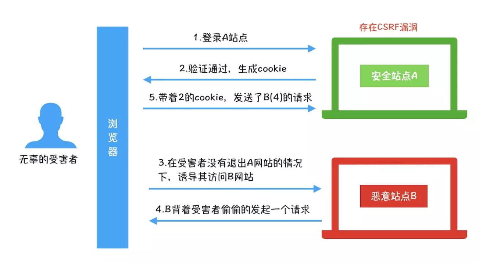

### 1. sql注入

**要理解sql注入的场景，它的原理是什么，当前的数据库的解决方案是什么？**

利用现有应用程序，将(恶意) 的 SQL 命令注入到后台数据库

### 2. XSS(Cross-Site Scripting，跨站脚本攻击)

#### 1. 常见的攻击场景

- 在 HTML 中内嵌的文本中，恶意内容以 script 标签形成注入。
- 在内联的 JavaScript 中，拼接的数据突破了原本的限制（字符串，变量，方法名等）。
- 在标签属性中，恶意内容包含引号，从而突破属性值的限制，注入其他属性或者标签。
- 在标签的 href、src 等属性中，包含 `javascript:` 等可执行代码。
- 在 onload、onerror、onclick 等事件中，注入不受控制代码。
- 在 style 属性和标签中，包含类似 `background-image:url("javascript:...");` 的代码（新版本浏览器已经可以防范）。
- 在 style 属性和标签中，包含类似 `expression(...)` 的 CSS 表达式代码（新版本浏览器已经可以防范）。

#### 2. 什么类型的网站容易被xss攻击

带有用户保存数据的网站功能，如论坛发帖、商品评论、用户私信等。<small>存储型</small>

##### 2.1 整个流程的原理是什么？

攻击者将恶意代码提交到目标网站的数据库中。

用户打开目标网站时，网站服务端将恶意代码从数据库取出，拼接在 HTML 中返回给浏览器。

用户浏览器接收到响应后解析执行，混在其中的恶意代码也被执行。

恶意代码窃取用户数据并发送到攻击者的网站，或者冒充用户的行为，调用目标网站接口执行攻击者指定的操作。

#### 3. 对策：

- 做了 `HTML` 转义、`JSON` 转义，并不等于高枕无忧。
- 对于链接跳转，如 或 `location.href="xxx"`，要检验其内容，禁止以 `javascript:` 开头的链接，和其他非法的 scheme。
- HTML 转义是非常复杂的，在不同的情况下要采用不同的转义规则。如果采用了错误的转义规则，很有可能会埋下 XSS 隐患。
- 在使用 `.innerHTML`、`.outerHTML`、`document.write()` 时要特别小心，不要把不可信的数据作为 HTML 插到页面上，而应尽量使用 `.textContent`、`.setAttribute()` 等。
- 应当尽量避免自己写转义库，而应当采用成熟的、业界通用的转义库。

### 3. CSRF（Cross-site request forgery）跨站请求伪造

> CSRF（Cross-site request forgery）跨站请求伪造：攻击者诱导受害者进入第三方网站，在第三方网站中，向被攻击网站发送跨站请求。利用受害者在被攻击网站已经获取的注册凭证，绕过后台的用户验证，达到冒充用户对被攻击的网站执行某项操作的目的。

**其实就是一个钓鱼网站，要理解为什么会收到攻击，应该采取什么策略进行防御。**

- 攻击一般发起在第三方网站，而不是被攻击的网站。被攻击的网站无法防止攻击发生。
- 攻击利用受害者在被攻击网站的登录凭证，冒充受害者提交操作；而不是直接窃取数据。
- 整个过程攻击者并不能获取到受害者的登录凭证，仅仅是“冒用”。
- 跨站请求可以用各种方式：图片URL、超链接、CORS、Form提交等等。部分请求方式可以直接嵌入在第三方论坛、文章中，难以进行追踪。

CSRF通常是跨域的，因为外域通常更容易被攻击者掌控。但是如果本域下有容易被利用的功能，比如可以发图和链接的论坛和评论区，攻击可以直接在本域下进行，而且这种攻击更加危险。

**防御策略**

- 阻止不明外域的访问
  - 同源检测
  - Samesite Cookie
- 提交时要求附加本域才能获取的信息
  - CSRF Token
  - 双重Cookie验证

### cookie安全

**要理解为什么用token，优势等。**

### 密码安全

**主要是用户登陆，用户数据提交，加密，存入数据库的一整个流程。**