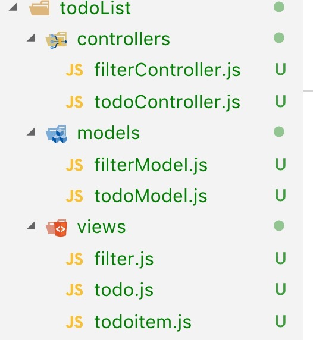
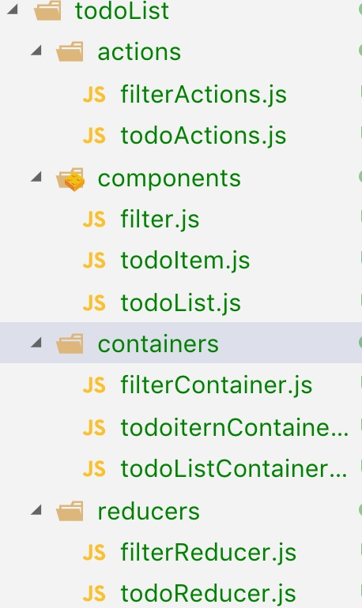
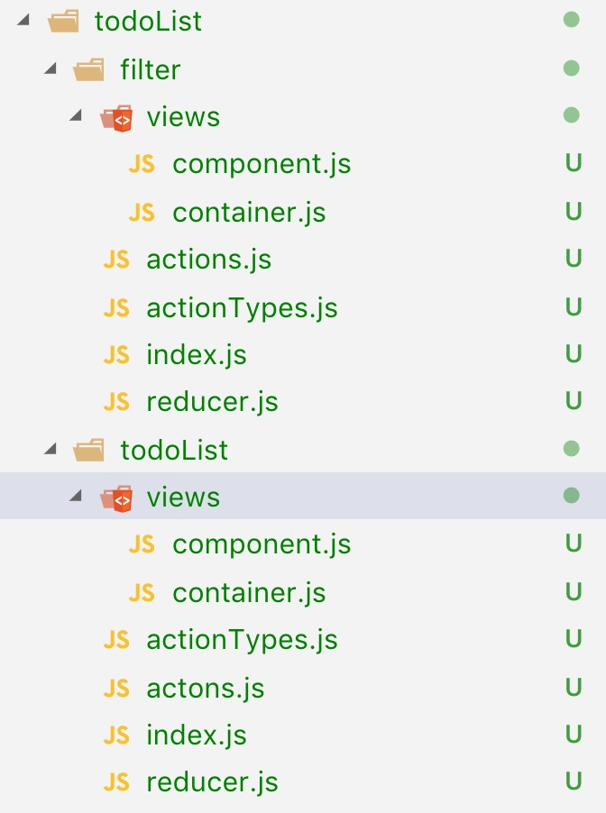

## 模块化 React 和 Redux 应用
  当我们开始一个新的应用的时候，有件事情是一定要考虑清楚的，因为随着项目的增大，我们需要创建的项目结构和大小都越来越复杂，一个好的代码结构能够给我们省事不少。本篇会以todo应用为代表进行项目文件的划分，因为每个框架问世的时候都会用todo进行展示。
> “在最理想的情况下，我们应该通过增加代码就能增加系统的功能，而不是通过对现有代码的修改来增加功能 一一－Robert C. Martin 
### 模块化应用的要点
  + 代码文件的组织结构；
  + 确定模块的边界；
  + Store 的状态树设计
上面的三件事情，是构建一个应用的基础 如果我们在开始深入思考这些，并作出合乎需要的判断，可以在后面的路上省去很多麻烦

### 代码文件的组织方式
#### 按角色组织（MVC）
 1. MVC的方式
  + Model （模型）负责管理数据 ，大部分业务逻辑也应该放在 Model 中；
  + View （视图）负责渲染用户界面，应该避免在 View 中涉及业务逻辑；
  + Controller （控制器）负责接受用户输入 根据用户输入调用对应的 Model 部分逻辑，把产生的数据结果交给 View 部分，让 View 渲染出必要的输出
  
  上图就是按角色进行代码的划分，这种方式简单明了，一眼就能看出这个文件夹的作用，这种方式就是把所有的Conoller代码放在controllers录下，把所有的Model代码放在models目录下，把View代码放在views目录下，这种组织代码的方式，叫做“按角色组织”。把一个应用划分成多个组件，采用分而治之的策略,需要新增一个功能的时候每个文件夹都要打开一遍，稍微繁琐，二期model和view存在多对多的关系，容易乱掉。
2. MVVM
  + MVC的思想是用户请求先到达controller，然后controller调用model得到数据，然后把数据交给view，但是实际情况是，总是允许model和view直接通信
  + 服务端的MVC是controller-model-view走一圈把结果返回给浏览器就结束这个过程，是严格的单向数据流。但在浏览器端，存在用户交互，model和view依旧存在浏览器中，为了方便二者对话就有了mvvm
3. 改进版的MVC
  + 因为MVC的模式影响久远在react和redux应用中就有了这样的一种代码结构划分的方式
  
  + reducers目录包含所有的reducer
  + actions包含所有的action
  + components包含所有的傻瓜组件
  + containers包含所有的容器组件
这种方式是把一个类型的文件放在一个文件夹中，当应用足够复杂时，代码文件会很多不好查找，弊端同上，当你修功能的时候需要打开这几个文件夹找对应的文件，会比较烦。
#### 按功能组织
  首先我们分析一下我们的应用的功能，目前的功能有两个todoList和filter所以就有如下代码结构：
  
  + actionTypes.js定义action类型；
  + actions.js定义 action 构造函数，决定了这个功能模块可以接受的动作；
  + reducer.js定义这个功能模块如何相应 actions. 中定义的动作；
  + views目录,包含这个功能模块中所有的 React 组件，包括傻瓜组件和容器组件；
  + index.js 这个文件把所有的角色导人，然后统一导出
  这样修改对应的功能的时候只需要进入对应的目录，所关联的文件都在这个目录下。不同的模块之间的依赖关系比较弱，自己不依赖于外界，外界不依赖于自己
  因为每个模块间免不了的有依赖，所以我们这样把自己暴露出去,依todoList功能为例：
  ```
  import * as actions from './actons'
  import reudcer from './reducer'
  import view from './views/container'
  export {actions,reudcer,view}
  ```
  其它文件想用的时候可以导入这个todoList文件夹
  ```
  import {actions,reudcer,view as todoList} from '../todoList';
  ```
  ### 状态树（store）的设计
    上面的几种划分方式只是一个约束条件，遵守后代码结构会清晰一些。store的设计则更为重要，store状态树的设计，直接决定了我们要写哪些reducer和action
    这里有几个规约：
  1. 一个模块控制一个状态节点：这里的控制指的是对store状态树上某字段下的数据的修改行为。例如模块todoList的reducer负责修改store上的todoListData字段下的数据，那么其他模块的reducer就并不能修改这个字段下的数据，另外关于store上的数据任何模块都是可以读取到的。
  2. 避免冗余数据：我们尽量保持数据的一致性，关于这个暂无能力讨论。
  3. 树形结构扁平：树形结构如果很深的话，就会出现如A-B-C-D-E的数据结构，我们如果要访问E就只能通过逐级访问，不过可能会存在某个节点以及后续节点为空的情况，我们就需要进行一个个的判断了比较麻烦（）。

  ### todo应用实例
  #### 思路
  我们按照按照功能划分的方式来组织文件的结构，每个功能模块下都有一个index.js负责对外暴露，其它模块需要引入此模块下的内容的话直接导入该文件夹即可，避免直接导入该文件夹下的其它文件（例如：action等）
  我们先分析一下界面功能
  1. 代办事项列表，同时包含删除、增加按钮、和新增事项输入框（因为二者的结合度高）
      +  既然是列表用数组较为合适，store上面应该有一个对象组合的列表。
      ```
      [{
        id:string//唯一标识，
        text:string//内容,
        completed:boolean//此事项是否完成
      },
      ...
      ]
      ```
  2. 过滤（过滤不同类型事项）
    + 所有已完成的事项
    + 所有待完成的事项
    + 全部的事项
  我们通过设置一个字段filter的值来标识上面三种选项，最简单地就是用0、1、2进行标识，可是0、1、2不是很直观，其它人并不一定知道是什么意思，所以我们采用`COMPLELT`、`UNCOMPLETE`、`ALL`、来标识如下
  ```
  {
  todos:[
    {
      id:'',
      text:'',
      complete:false
    },
  ],
    filters:'all'
  }
  ```
  增加一个事项就在todos中增加一项，改变todos中事项是否完成时更新complete字段值。
#### 编码
入口文件
/src/index.js
```
ReactDOM.render(
  <Provider store={store}>
    <TodoApp />
  </Provider>,
  document.getElementById('root')
);
```
顶层文件

/src/TodoApp.js

```
import React, { Component } from 'react'
import {view as Todos} from './todoList'
import {view as Filter } from './filter'

export default class TodoApp extends Component{
  render(){
    return(
      <div>
        <Todos></Todos>
        <Filter></Filter>
      </div>
    )
  }
}

```
