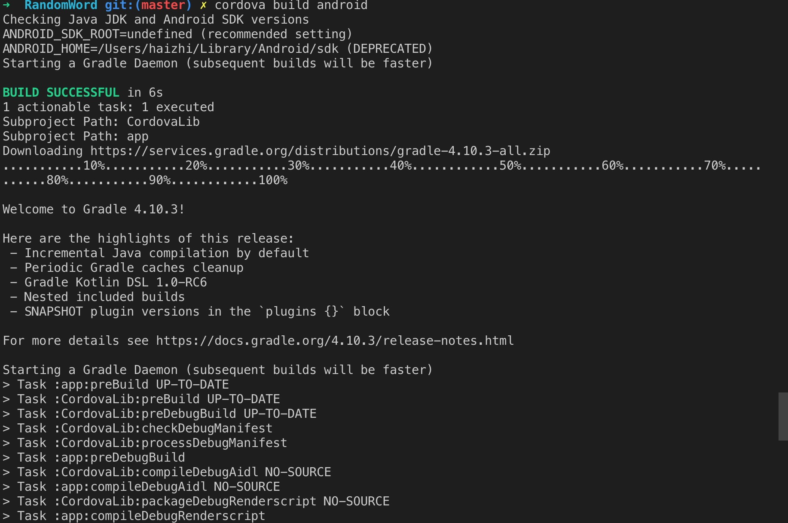
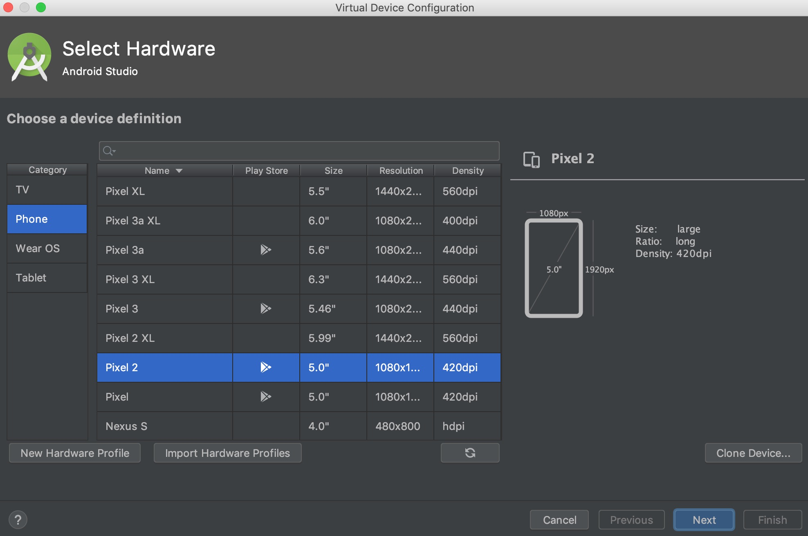

废话不多说，直接开始，运行中会下载很多东西，需要网络环境稳定良好。
### 1.安装 cordova
```
yarn global add cordova
```
### 2.创建一个 cordova 项目
```
cordova create 
```
### 3.进入项目,添加安卓平台（iOS同理）
```
cordova platform add android --save
```
### 4.检查你是否具备使用 Cordova 开发/运行 Android 应用的条件
注意：要在创建的项目目录的根路径下运行
```
cordova requirements
```

#### 4.1 缺什么补什么
  + [JDK](https://www.oracle.com/technetwork/java/javase/downloads/jdk8-downloads-2133151.html) 需要注册一个oracle的账号 很简单
  + [Gradle](https://gradle.org/install/) 选择一个适合自己平台的版本
  + [Android SDK](https://developer.android.com/studio/?hl=zh-cn) 直接下就行
    + 这里下载好后运行 `cordova requirements` 看看还缺什么不缺 缺了继续下载 我安装好后下载了一个 Android-28 API
    
#### 4.2 确保安装成功所有依赖
  
### 5.设置环境变量 OS X and Linux (关键的一步 决定后面能不能启动模拟器)
 ```
  $ 一般路径为 Users/zhangsan/Library/Android/sdk
  export ANDROID_SDK='你的Android sdk 路径'
  export PATH=${PATH}:${ANDROID_SDK}/emulator:${ANDROID_SDK}/tools
 ```
  
### 6.创建一个安卓程序，并运行
  
```
cordova build android
```
在 xxx/platforms/android/app/build/outputs/apk/debug/app-debug.apk 有你创建的 `.apk` 安装包 可以装到安卓手机上试试 

  + 模拟器（因为我没有安卓手机）
  ```
  cordova run android
  ```
  然后我们发现有问题 没有模拟器
  
  + [解决问题](https://developer.android.com/studio/run/managing-avds.html) 创建和管理虚拟设备
  + 根据需要进行选择 然后选择对应的 level 然后点击 next 进行下载 时间会久一点
  
  + 再次执行
   ```
  cordova run android
  ```
  
  


