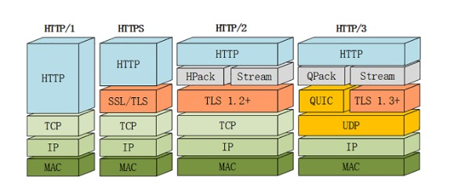

## HTTP 、HTTPS

### HTTP 协议是什么？有哪些特点？

+ header + body 结。 **起始行 + 头部 + 空行 + 实体**

```http
# 起始行 方法 + 路径 + 版本号
GET /home HTTP/1.1
```

+ GET 与 POST 有什么区别？
+ 

1. 在 HTML 的 form 标签里，method 支持哪些类型？

### HTTPS

> 出现是为了解决 HTTP 明文传输带来的安全性问题，因在 HTTP 传输的过程中任何人都可以截获，修改等。HTTPS 提供了三个保障：加密（客户端和服务端交互），数据一致性（传输的数据一致），身份认证（防止中间人攻击）。

传输层安全性(`TLS`)，安全套接字层(`SSL`)。`TLS` 是 `SSL` 的后续版本。它们是用于计算机之间的身份验证和传输加密数据的一种协议。

**HTTP + TSL(SSL) = HTTPS** 相当于在 `HTTP` 外面套了一层 `SSL` ，`HTTP` 先和 `TSL` 通信，`TLS` 在根本上使用`对称加密`和 `非对称加密` 两种形式。`TLS` 是一个双向验证的过程，握手正式结束后，`HTTP` 才开始正式的加密报文传输。


+ http 进行非对称加密，得到 https，这个过程是怎么样的？什么是 CA 证书？整个网站进行验证的流程是什么？

  浏览器发送 client_random 等

  服务端确认 server_random tls 版本等

  客户端验证证书，验证通过 生成 secret

  服务端生成 secret

  

  采用 hash 算法，公钥加密，私钥解密

+ http 各个版本的区别是什么？解决了哪些问题？比如头部缩减的优化，那你了解这个优化的具体策略吗？缩减了什么？又增加了什么？要深挖细节。

  + http 1.1 的缺陷高延时，带来的页面加载速度降低。
    + 将同一页面的资源分散到不同域名下（Chrome对于同一个域名，默认允许同时建立 6 个 TCP持久连接）
    + Spriting合并多张小图为一张大图
  + http 头部巨大 （"User Agent""Cookie""Accept""Server"）等
  + http 1.1 解决了明文传输--带来的不安全性
  + http2
    + HTTP/2基于SPDY，专注于性能，最大的一个目标是在用户和网站间只用一个连接（connection）
    + 使用HTTP/2能带来20%~60%的效率提升。

+ HTTP 2 新特性

  + 资源优先级和依赖设置
  + 服务器推送
  + 流量控制
  + 重置消息
  + 头部压缩、二进制传输
    + 以二进制方式传输 和 Header 压缩，。建立索引表让请求头字段得到极大程度的精简和复用。原来的"Header+Body"的消息"打散"为数个小片的二进制"帧，用**Headers帧**存放头部字段，**Data帧**存放请求体数据
  + 多路复用
    + **HTTP/2是基于二进制“帧”的协议，HTTP/1.1是基于“文本分割” （key:value）解析的协议。** 所有 HTTP2很好的解决了浏览器限制同一个域名下的请求数量的问题，同时也接更容易实现全速传输
    + 一次请求完成（html css js 下载到浏览器）
    + 新的二进制帧层，使得所有的请求和响应多路复用。通过允许客户端和服务端把HTTP消息分解成独立的帧，交错传输，然后在另一端组装。
  + HTTP/2 使用 TCP 协议来传输的，而如果使用 HTTPS 的话，还需要使用 TLS 协议进行安全传输，而使用TLS也需要一个握手过程，**这样就需要有两个握手延迟过程**：

+ HTTP 1、2、3

  

  + http3 基于 UDP 的 Quic  

  + HTTP/1.1 有两个主要的缺点：安全不足和性能不高。

  + HTTP/2 完全兼容HTTP/1，是“更安全的HTTP、更快的HTTPS"，头部压缩、多路复用等技术可以充分利用带宽，降低延迟，从而大幅度提高上网体验；

  + QUIC 基于 UDP 实现，是 HTTP/3 中的底层支撑协议，该协议基于 UDP，又取了 TCP 中的精华，实现了既快又可靠的协议

    

1. 
7. URI和URL的区别？
    + URI是`Uniform Resource Identifier`的缩写,统一资源标识符,即由某个协议方案表示的资源的定位标识符
    + URI 用字符串标识某一互联网资源，而 URL表示资源的地点（互联网上所处的位置）。可见 URL是 URI 的子集<br>
    + URI的例子
    
    + 绝对URI的格式,遵循以下规则。
    
8. 一次完整的Http请求所经历哪些步骤？
## HTTP 进阶

+ 说说Http协议的工作流程
+ Http请求报文与响应报文的格式？
+ Http首部包含哪些字段？举例说明
+ Https的原理是什么？
+ 浅析Http和Https的三次握手有什么区别。
+ 谈谈Session/cookie机制，如何实现会话跟踪？
+ 什么是Web缓存？原理如何？
+ OSI有哪七层模型？TCP/IP是哪四层模型。
+ 讲一讲TCP协议的三次握手和四次挥手流程。
+ 为什么TCP建立连接协议是三次握手，而关闭连接却是四次握手呢？为什么不能用两次握手进行连接？
+ websockt是什么？和Http有什么区别？
+ 什么是非持久连接，什么是持久连接？
+ Keep-Alive: timeout=5, max=100是什么意思？
+ http1.0，http1.1，http2.0区别（HTTP1.1版本新特性？HTTP2版本新特性？）
+ 对Http代理做个介绍？
+ 常见的鉴权方式有哪些？
+ http 2 http3
  + 以富媒体（如图片、声音、视频）


## Cookie

### 1. Cookie 

> Cookie（复数形态Cookies），类型为「小型文本文件」，指某些网站为了辨别用户身份而储存在用户本地终端上的数据。

#### 1.1 Cookie 有什么用？

为了解决 `HTTP` 无状态导致的问题中，客户端与服务端会话状态的问题。这个状态单指后端服务的状态而非通信协议的状态。

1. 会话状态管理（如用户登录状态、购物车、游戏分数或其它需要记录的信息）
2. 个性化设置（如用户自定义设置、主题等）
3. 浏览器行为跟踪（如跟踪分析用户行为等）

#### 1.2 Cookie 有哪些部分组成？

作为一段一般不超过 4KB 的小型文本数据，它由一个名称（Name）、一个值（Value）和其它几个用于控制 Cookie 有效期、安全性、使用范围的可选属性组成。

+ Name / Value

  + 用 JavaScript 操作 Cookie 的时候注意对 Value 进行编码处理。

+ Expirse

  + 用于设置 Cookie 的过期时间。 
  + 当 Expires 属性缺省时，表示是会话性 Cookie。关闭浏览器失效。有些浏览器提供了会话恢复功能，这样会保存 Cookie。
  + 过期的时间只与客户端相关，而不是服务端。

+ Max-Age

  + 用于设置在 Cookie 失效之前需要经过的秒数

    ```js
    res.cookie('userid', user._id, {maxAge: 1000 * 60 * 60 * 24})
    ```

  + Max-Age 可以为正数、负数、甚至是 0。

  + 如果 max-Age 属性为正数时，浏览器会将其持久化，即写到对应的 Cookie 文件中。

  + 当 max-Age 属性为负数，则表示该 Cookie 只是一个会话性 Cookie。

  + 当 max-Age 为 0 时，则会立即删除这个 Cookie。

  + 假如 Expires 和 Max-Age 都存在，Max-Age 优先级更高。

+ Domain

  + 指定了 Cookie 可以送达的主机名

  + 没有指定默认是当前主机部分（不含子域名）

    ```http
    .xxx.com
    ```

+ Path

  + Domain 和 Path 标识共同定义了 Cookie 的作用域：即 Cookie 应该发送给哪些 URL

+ Secure

  + 标记为 Secure 的 Cookie 只应通过被 HTTPS 协议加密过的请求发送给服务端

+ HTTPOnly

  + 设置 HTTPOnly 属性可以防止客户端脚本通过 document.cookie 等方式访问 Cookie，有助于避免 XSS 攻击。

+ #### SameSite

  *Chrome80 版本中默认屏蔽了第三方的 Cookie*

  + SameSite 属性可以让 Cookie 在跨站请求时不会被发送，从而可以阻止跨站请求伪造攻击（CSRF）。
    + **Strict**浏览器将只发送相同站点请求的 Cookie,当前网页 URL 与请求目标 URL 需完全一致。
    + **Lax** 允许部分第三方请求携带 Cookie
    + **None** 无论是否跨站都会发送 Cookie
  + 之前默认是 None 的，Chrome80 后默认是 Lax。

#### 1.3 如何查看 Cookie ? 

+ 可以在浏览器的开发者工具中查看到当前页面的 Cookie
+ 可以在计算机上查看本机的 Cookies 文件 (<small>以 Mac 为例</small>)
  + 路径为:`/Users/haizhi/Library/ApplicationSupport/Google/Chrome/Default`
  + 它是一个 `sqlite` 数据库文件，可以用 `sqlite` 客户端打开查看。

#### 1.4 怎么设置 Cookie

1. 客户端发送 HTTP 请求到服务器

   ```js
   // 登录
   export const reqLogin = data => request('/login', 'POST', data)
   ```

2. 当服务器收到 HTTP 请求时，在响应头里面添加一个 Set-Cookie 字段 (<small> `express` 为例</small>)

   ```js
   router.post('/login', (req, res) => {
     // if success
     res.cookie('userid', user._id, {maxAge: 1000 * 60 * 60 * 24})
   })
   ```

3. 浏览器收到响应后保存下 Cookie

   收到响应：

   

   保存 Cookie:

   

4. 之后对该服务器每一次请求中都通过 Cookie 字段将 Cookie 信息发送给服务器。

   

#### 1.5 Cookie 的缺点

+ 大小方向
+ 安全方向
+ 增加请求方向

## 请求库默认携带 cookie 的情况

+ fetch

  + `fetch` 在默认情况下, 不管是同域还是跨域`` ajax` 请求都不会带上`cookie`, 只有当设置了 `credentials` 时才会带上该 `ajax` 请求所在域的 `cookie`, 服务端需要设置响应头 `Access-Control-Allow-Credentials: true`, 否则浏览器会因为安全限制而报错, 拿不到响应

  ```js
  fetch(url, {
      credentials: "include", // include, same-origin, omit
  })
  // include: 跨域 ajax 带上 cookie
  // same-origin: 仅同域 ajax 带上 cookie
  // omit: 任何情况都不带 cookie
  ```

  

+ axios

  + `axios` 和 `jQuery` 在同域 `ajax` 请求时会带上 `cookie`, 跨域请求不会, 跨域请求需要设置 `withCredentials` 和服务端响应头

  ```js
  axios.get('http://server.com', {withCredentials: true})
  ```

  

