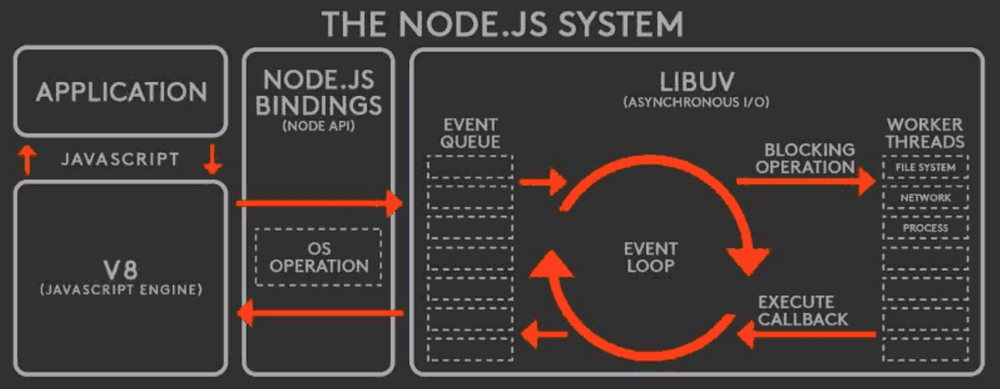
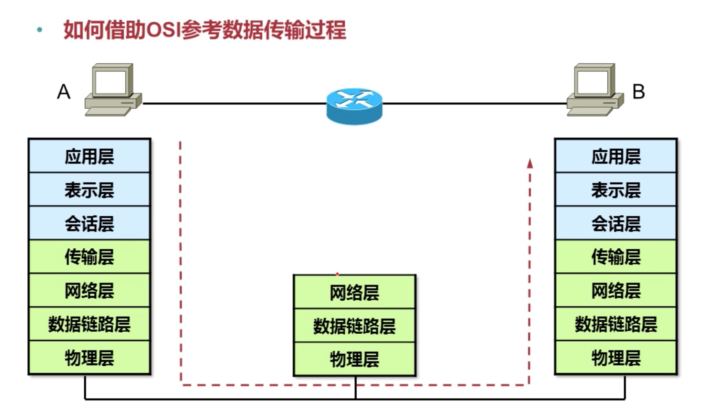
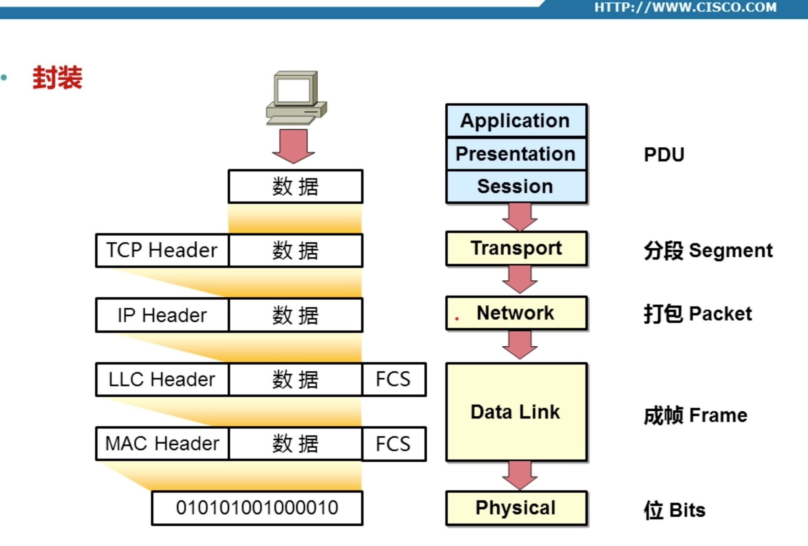
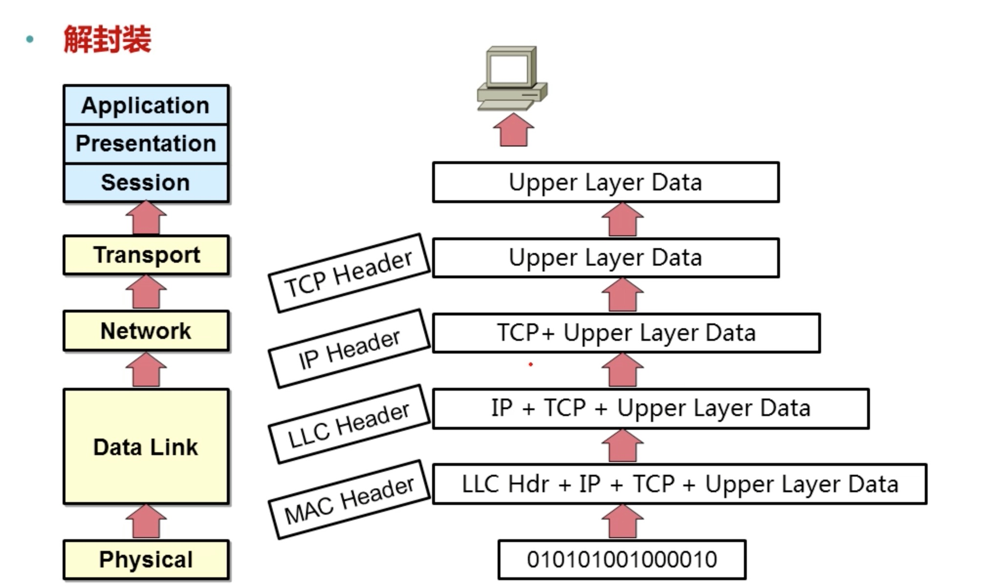
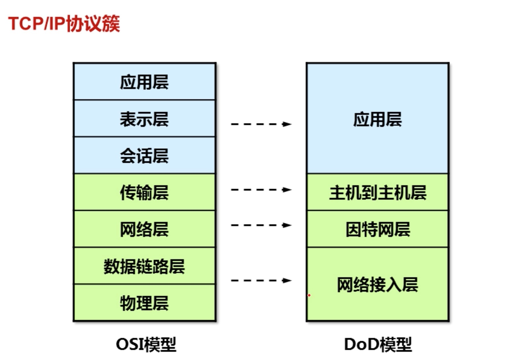
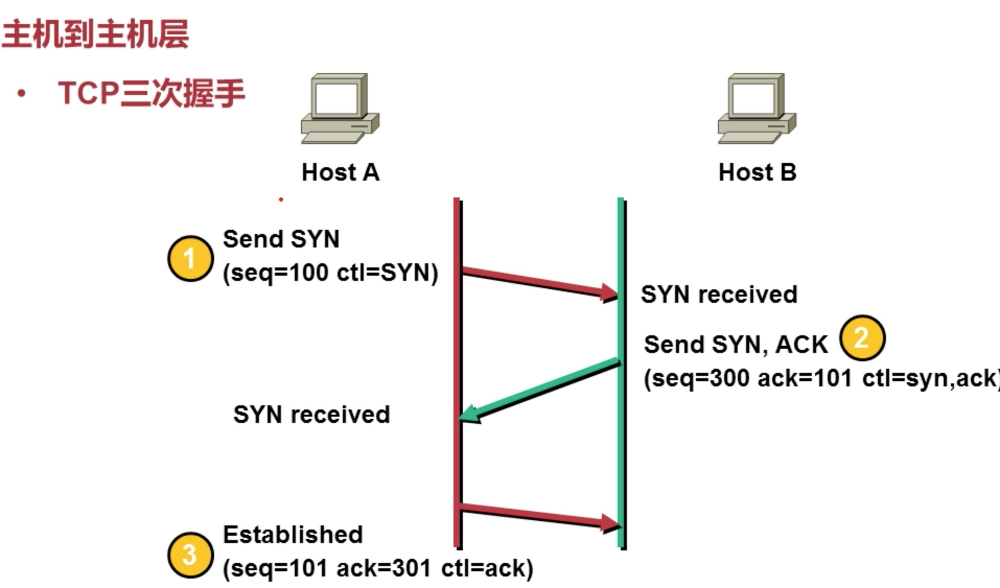
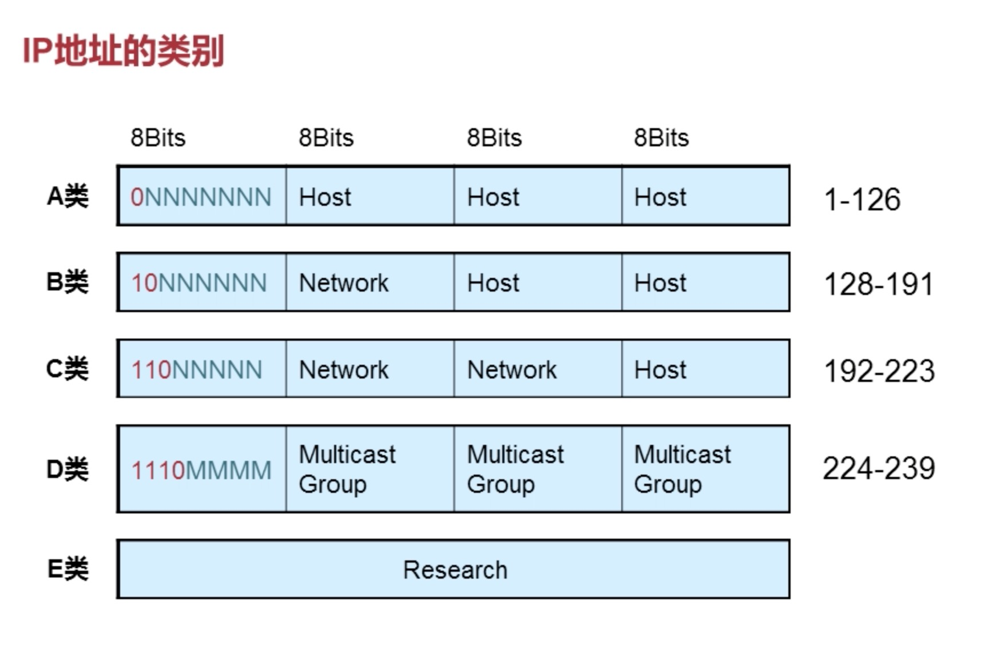
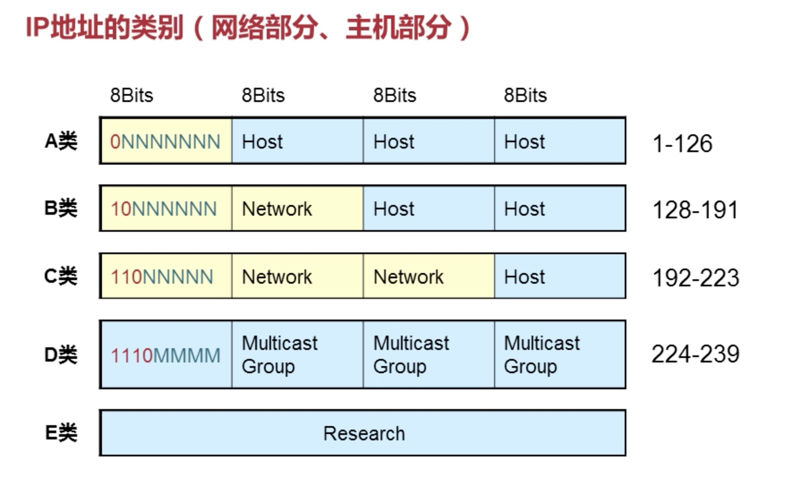
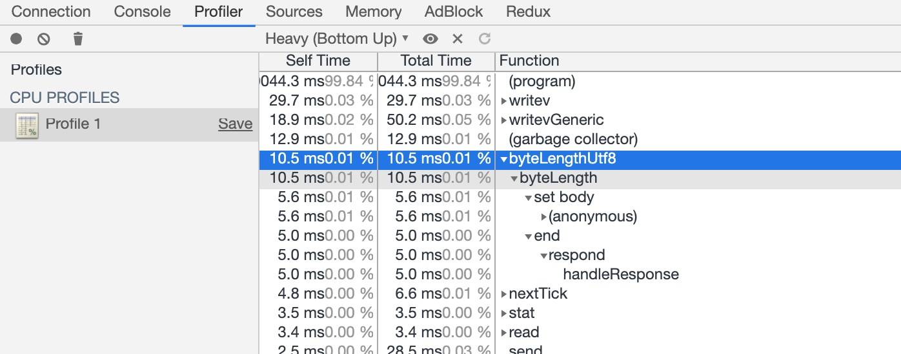
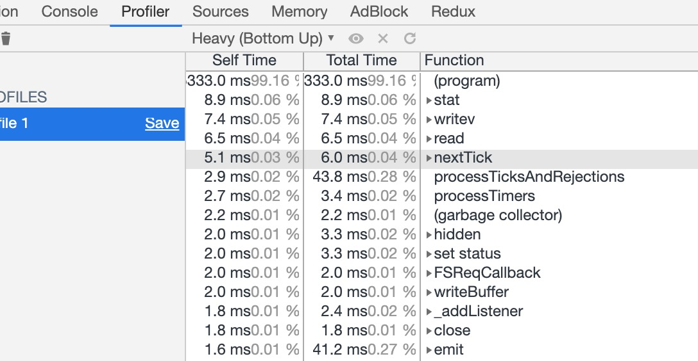

## Node.js
###  1. Node 环境的 js 和 Chrome 环境的 js 运行的不同点

> js执行为单线程（不考虑web worker），所有代码皆在执行线程调用栈完成执行。当执行线程任务清空后才会去轮询取任务队列中任务。

+ Nodejs 没有浏览器的 API，如 document、window等。
+ 加入了许多 NodeJS 的 API。
+ Js 控制浏览器，Node.js 控制计算机。

###  2. Node.js 应用领域

+ web 服务
  + 搜索引擎优化，首屏加速。采取服务端渲染。
+ 客户端应用
  + 在已有网站的情况下，需要开发新的客户端
  + 用 Node.js 客户端技术 （electron）实现，最大限度的复用现有的工程。

###  3. BFF 层

> Backend for Frontend 为前端服务的后端


+ 对用户侧提供 HTTP 服务
+ 使用后端 RPC 服务 

### 4. 小游戏

#### 4.1 实现步骤

[石头✂️布](https://github.com/Composur/v2ex-nodejs/tree/master/CommonJS)

输入你要出的类型回车即可。


用到了 `process` 较多的的属性。如` argv` 、`stdin`...

步骤：

1. 取到用户的控制台输入

   ```js
   const userAction = process.argv[process.argv.length - 1]
   ```

2. 运算逻辑

   ```js
   // 如果没有导出 其它文件引入该文件默认是一个空对象
   module.exports = function (userAction) {
     const { log } = console
     // 计算机随机出一个
     let random = Math.random() * 3
     let computerAction;
     const rock = 'rock', paper = 'paper', scissor = 'scissor';
     if (random < 1) {
       computerAction = rock
     } else if (random > 2) {
       computerAction = paper
     } else {
       computerAction = scissor
     }
     log(`你出了${userAction}；计算机出了${computerAction}`)
     if (userAction === computerAction) {
       log('平局！！')
       return 0
     } else if (
       (userAction === rock && computerAction == scissor) ||
       (userAction === paper && computerAction == rock) ||
       (userAction === scissor && computerAction == paper)
     ) {
       log('你赢了！！')
       return -1
     } else {
       log('你输了！！')
       return 1
     }
   }
   ```

3. 监听输入

   ```js
   const playAction=require('./lib/common') 
   let result=0;
   // 让程序不中断，一直执行
   process.stdin.on('data',e=>{
     const userInputValue=e.toString().trim()
     result= playAction(userInputValue)
     if(result==-1){
       result++
       console.log(result)
     }
     if(result===3){
       console.log('你太厉害了！！')
       process.exit()
     }
   })
   ```

#### 4.2 CommJS 规范

##### 4.2.1 没有规范出现的问题

1. 没有 `<script></script> `就写不了 js 代码
2. 脚本变多的时候需要手动加载管理
3. 不同脚本间的调用，需要通过全局变量的方式。

##### 4.2.2 Require()

如何引入一个 js

```js
// a.js
console.log('a.js')
export.a = 'a'

// b.js
const lib = require('a.js')
// 如果没有 export.xx 进行导出的话 require 引入的默认是一个空对象
console.log(lib) // {a:'a'}
```

问题：b.js 中 lib 的引用和 a.js 是否是同一个引用 ？**答案：是统一引用**

```js
// a.js
console.log('我是a.js')
setTimeout(()=>{
  console.log(exports) //  1 秒后打印 { addNewProperty: '我是b.js中新增加的属性' }
},1000)


// b.js
const lib = require('./a')
console.log('我是b.js',lib) // 我是b.js {}
lib.addNewProperty = '我是b.js中新增加的属性'
```

##### 4.2.3 module.exports vs exports

`module.exports ` 会把所有 `exports ` 导出覆盖掉。

 ```js
// a.js
exports.hello = '我是a.js'
setTimeout(()=>{
  console.log(exports) // { hello: '我是a.js' }
},1000)

module.exports=function test(){
  console.log('我是a.js导出的function')
}

// b.js
const lib = require('./a')
console.log('我是b.js',lib) // 我是b.js [Function: test]
lib.addNewProperty = '我是b.js中新增加的属性'
console.log(lib.hello) // undefined
 ```

##### 4.2.4 Webpack 中的 CommonJS

Webpack 会把所有的 .js 文件分析一遍，然后打包成一个大的 main.js 文件。在这个 main.js 中每个所有的 .js 文件以一个函数的形成存在。

```js
//a.js
console.log('a.js')

//b.js
console.log('b.js')
```

webpack 打包后：

```js

/***/ "./a.js":
(function(module, exports) {
	eval("console.log('a.js')\n\n//# sourceURL=webpack:///./a.js?");
}),
   
/***/ "./b.js":
(function(module, exports) {
	eval("console.log('b.js')\n\n//# sourceURL=webpack:///./b.js?");
}),
  
/***/ "./index.js":
(function(module, exports, __webpack_require__) {
	eval("__webpack_require__(/*! ./a */ \"./a.js\")\n__webpack_require__(/*! ./b */ \"./b.js\")\nconsole.log('index.js')\n\n//#sourceURL=webpack:///./index.js?");
 })
```


会有一个函数

```js
// 传入一个 id  入口
/******/ 	function __webpack_require__(moduleId) {
/******/		// 是否有缓存
/******/ 		// Check if module is in cache
/******/ 		if(installedModules[moduleId]) {
  					// 返回上一次的结果
/******/ 			return installedModules[moduleId].exports;
/******/ 		}
  					// 如果没有命中缓存
/******/ 		// Create a new module (and put it into the cache)
/******/ 		var module = installedModules[moduleId] = {
/******/ 			i: moduleId,
/******/ 			l: false,
/******/ 			exports: {}
/******/ 		};
/******/
/******/ 		// Execute the module function
  					// 调用模块
/******/ 		modules[moduleId].call(module.exports, module, module.exports, __webpack_require__);
/******/
/******/ 		// Flag the module as loaded
/******/ 		module.l = true;
/******/
/******/ 		// Return the exports of the module
/******/ 		return module.exports;
/******/ 	}
```

### 5. Node.js 内置模块



根据上图所示，由 JavaScript 到 V8 再到 Node.js 的能力大部分是由内置模块提供的，所以我们必须要了解一些核心 `fs` `os` `net` `Process` ... 等模块。

#### 5.1 js 和 node.js 的交互

例如我们想通过 js 获取计算机的 `cpu` 信息：

1. 打开 node 的 [os.js](https://github.com/nodejs/node/blob/master/lib/os.js) 模块（在 lib 文件夹里面）。

```js
const {
  getCPUs,
  ...
} = internalBinding('os'); // internalBinding 是 V8 的方法 

function cpus() {
  // 通过引入的 os 得到 getCPUs() 
  const data = getCPUs() || [];
  const result = [];
  let i = 0;
  while (i < data.length) {
    result.push({
      model: data[i++],
      speed: data[i++],
      times: {
        user: data[i++],
        nice: data[i++],
        sys: data[i++],
        idle: data[i++],
        irq: data[i++]
      }
    });
  }
  return result;
}

module.exports = {
  cpus, // 一个方法
  ...
};
```

2. C++ 提供的方法

[node_os.cc](https://github.com/nodejs/node/blob/master/src/node_os.cc)

```c++
// node_os.cc
//  v8 转化 js

static void GetCPUInfo(const FunctionCallbackInfo<Value>& args) {
  Environment* env = Environment::GetCurrent(args);
  Isolate* isolate = env->isolate();

  uv_cpu_info_t* cpu_infos;
  int count;

  int err = uv_cpu_info(&cpu_infos, &count);
  if (err)
    return;
  
  std::vector<Local<Value>> result(count * 7);
  for (int i = 0, j = 0; i < count; i++) {
    uv_cpu_info_t* ci = cpu_infos + i;
    result[j++] = OneByteString(isolate, ci->model);
    result[j++] = Number::New(isolate, ci->speed);
    result[j++] = Number::New(isolate, ci->cpu_times.user);
    result[j++] = Number::New(isolate, ci->cpu_times.nice);
    result[j++] = Number::New(isolate, ci->cpu_times.sys);
    result[j++] = Number::New(isolate, ci->cpu_times.idle);
    result[j++] = Number::New(isolate, ci->cpu_times.irq);
  }
	
  // C++ 的方法去获取 cpu 信息
  uv_free_cpu_info(cpu_infos, count);
  
  // 转成 js 能用的
  args.GetReturnValue().Set(Array::New(isolate, result.data(), result.size()));
}


void Initialize(Local<Object> target,
                Local<Value> unused,
                Local<Context> context,
                void* priv) {
  Environment* env = Environment::GetCurrent(context);
  
  // 这里提供了 GetCPUInfo 方法
  env->SetMethod(target, "getCPUs", GetCPUInfo);
	...
  target->Set(env->context(),
              FIXED_ONE_BYTE_STRING(env->isolate(), "isBigEndian"),
              Boolean::New(env->isolate(), IsBigEndian())).Check();
}
```

#### 5.2 实现一个事件收发器

操作系统底层通过 node.js 到 js 的过程，用我们上面的小游戏举例（node环境）：

```js
// 获取控制台的输入
// 这里用到了 EventEmitter 模块
process.stdin.on('data',e=>{
  const userInputValue=e.toString().trim()
  ...
})
```

`EventEmitter` 可以从 node 层抛出一些数据给 js 

**观察者模式**举例：

> 观察者（Observer）模式的定义：指多个对象间存在一对多的依赖关系，当一个对象的状态发生改变时，所有依赖于它的对象都得到通知并被自动更新。这种模式有时又称作发布-订阅模式、模型-视图模式，它是对象行为型模式。

后端每隔 2 秒通知一次前端：

*observer(观察者)*

```js
const EventEmitter=require('events').EventEmitter
class Test extends EventEmitter{
  constructor(){
    super()
    setInterval(() => {
      // 发射事件，给外面的业务代码抛出一些东西出去
      this.emit('listen',{date:Date(),test:'2秒触发一次'})
    }, 2000);
  }
}
module.exports=Test
```

*subscribe(订阅者)*

```js
const Test = require('./lib/EventEmitter') 
const test01 = new Test 

// 接收事件
test01.addListener('listen',(res)=>{
  // 这里可以进行业务逻辑处理
  console.log(res)
})

// {
//   date: 'Sat Mar 07 2020 21:10:50 GMT+0800 (GMT+08:00)',
//   test: '2秒触发一次'
// }
// {
//   date: 'Sat Mar 07 2020 21:10:52 GMT+0800 (GMT+08:00)',
//   test: '2秒触发一次'
// }
// {
//   date: 'Sat Mar 07 2020 21:10:54 GMT+0800 (GMT+08:00)',
//   test: '2秒触发一次'
// }
```

这样我们就实现了一个简单的事件收发器。这样做的缺点是：

1. 不知道被通知者是否存在。被通知者也不知道通知者是否存在。
2. 不知道被通知者是谁，谁都可以被通知到，广播的性质。


#### 5.3 Buffer (缓冲器)

> `Buffer` 类是作为 Node.js API 的一部分引入的，用于在 TCP 流、文件系统操作、以及其他上下文中与八位字节流进行交互。

#### 5.4 NET (网络)

> `net` 模块用于创建基于流的 TCP 或 [IPC](http://nodejs.cn/s/rAdYjf) 的服务器（[`net.createServer()`](http://nodejs.cn/s/e8cikS)）与客户端（[`net.createConnection()`](http://nodejs.cn/s/RTNxdX)）。

+ 服务端

  ```js
  const net = require('net')
  
  const server = net.createServer(socket=>{
    socket.on('data',data=>{
      // get client send data 
      console.log(data,data.toString()) // <Buffer 30 31> 01
    })
  })
  
  server.listen(12345,()=>{
    console.log(12345) 
  })
  ```

+ 客户端

  ```js
  const net = require('net')
  // Socket 网络中写入和取出的代理对象
  const socket = new net.Socket({}) 
  
  socket.connect({
    host:'127.0.0.1',
    port:12345
  },()=>{
    console.log('establish on 12345')
  })
  //单工模式 只能客户端向浏览器端发送数据
  socket.write('01') 
  ```

#### 5.5 Cluster (集群)

作用：分发 `HTTP` 请求。

`Node.js` 对浏览器提供服务，浏览器请求 `Node.js`，请求到了 master（主进程），假如 `fork` 4 个子进程（ `CPU`4 核心），每个子进程都运行一个 `HTTP` 服务，收到 `HTTP` 请求后并处理完成后返回给主进程，主进程再返回浏览器。

上面的逻辑可以借助 `cluster` 这个模块进行处理。

```js
// 添加启动脚本 app.js 进行多进程启动 充分利用 CPU 的多核心
const cluster = require("cluster");
const os = require("os");
const cpus = os.cpus();
if (cluster.isMaster) {
  // 根据 CPU 的最大核心数进行启动
  // 这样 会造成一定的浪费 内存空间使用率较高
  // 根据实际情况开启进程，一般开启一半就可以
  for (let i = 0; i < cpus.length; i++) {
    cluster.fork();
  }
} else {
  require("./app"); // 这样就会有多个进程监听 3000 端口
}
```

问题：多个进程是如何无冲突的监听一个端口？<small>理论上应该报错才对</small>

其实是主线程在监听，子线程监听的是一个类似 id 的东西。


### 6. Node.js 的异步、非阻塞 I/O

> 阻塞 I/O 非阻塞 I/O 的区别就是：**系统在接收输入再到输出期间，还能不能再接收其它输入**。
>
> "I/O" 主要指由 [libuv](https://libuv.org/) 支持的，与系统磁盘和网络之间的交互。

[阻塞对比非阻塞一览](https://nodejs.org/zh-cn/docs/guides/blocking-vs-non-blocking/)

####  6.1 同步（阻塞）举例：

在学校食堂窗口买饭，需要到窗口排队，你必须等到排到你才能选餐。需要等待。

<small>插队什么的不在考虑范围，会被女同学骂</small>。

#### 6.2 异步（非阻塞）举例：

去外面餐厅吃饭，进门就有服务员招呼你点餐，不用等待就可以选餐。

<small>餐厅生意火爆需要等几个小时的不在此考虑范围。</small>

#### 6.3 [nodejs中的阻塞与非阻塞](https://nodejs.org/zh-cn/docs/guides/blocking-vs-non-blocking/)

+ 照搬链接中的同步举例：

```js
const fs = require('fs');
// 文件的读取会耗时，这里会发生阻塞
const data = fs.readFileSync('/file.md'); 
console.log(data);
// 因为代码会同步执行，所以必须等到打印出 data 后，才能进行其他任务的处理
moreWork(); 
```

+ 异步非阻塞：

```js
const fs = require('fs');
// 这里是非阻塞的
fs.readFile('/file.md', (err, data) => {
  if (err) throw err;
  console.log(data);
});
moreWork();// 不必等到文件读取结束就可以执行此方法，此方法的执行不受文件读取的影响。
```

这个例子就是 nodejs 的核心：**异步非阻塞 I/O**。用等待时间，去做其它的事情，充分利用 CPU 。

**`nodejs` 通过一个 [libuv](https://libuv.org/) 实现了异步非阻塞 I/O , 上面的操作（点餐）都是在一个线程里面进行，通过  [libuv](https://libuv.org/) **

**把大量的计算分发给 `C++` 的众多模块去做，等到计算完成再把结果返回给 `nodejs` 线程，然**

**后`nodejs` 再把结果返回给应用程序。**

以去餐厅点餐为例：**`JavaScript + v8 + nodejs + libuv ` 就是服务员，`libuv + C++` 模块就是后厨**。<small> `libuv` 一半是服务员，一半是后厨。</small>

#### 6.4 事件循环

> 事件循环是 Node.js 处理非阻塞 I/O 操作的机制，依托 [libuv](https://libuv.org/)其中的一个操作完成的时候，内核通知 Node.js 将适合的回调函数添加到 *轮询* 队列中等待时机执行。

##### 6.4.1 事件轮询机制解析

Node.js 脚本启动后，开始初始化事件轮询，调用一些异步的 API、调度定时器，或者调用 `process.nextTick()`，然后开始处理事件循环。

下图为轮询的各阶段：一共六个阶段，每个框表示一个阶段。执行到当前阶段时，会把当前阶队列中的所有回调函数执行完毕。然后移动到下一个阶段。


+ timer（定时器阶段）
  + 轮询阶段（poll）控制何时执行定时器，当它的队列任务执行完毕（异步I/O），回到最接近定时器阀值的那个定时器，执行定时器中的回调。你设定的定时器延迟时间不一定就是真实的时间可能会超过这个时间。
+ poll （轮询阶段）
  + 计算应该阻塞和轮询 I/O 的时间
  + 处理 **轮询** 队列里的事件。直到队列为空。
  + 轮询为空，将检查已经达到阀值的定时器，然后回到 timer 阶段执行定时器的回调。
+ check （检查阶段）
  + 允许 `setImmediate()` 在当前阶段完成就执行回调。（需轮询队列为空，且使用 `setImmediate()`）
  + `setImmediate()` 利用 `libuv` API 让回调在 **轮询** 阶段完成后执行。

##### 6.4.2 `setImmediate()` vs `setTimeout()`

+ `setImmediate()` 和 `setTimeout() ` 类似，不同的地方上面说了，`setTimeout()` 回调是基于设置的毫秒值来执行，`setImmediate()` 是在当前 **轮询** 阶段完成， 就执行回调。

+ 不同情况下调用顺序会不一致

  + 不在同一个 I/O ，打印顺序受进程性能的约束，指不定是谁。

    ```js
    setTimeout(() => {
      console.log('timeout');
    }, 0);
    
    setImmediate(() => {
      console.log('immediate');
    });
    ```

  + 同一个 I/O 循环内调用，`setImmediate` 总是被优先调用。因为它在轮询结束就执行。

    ```js
    const fs = require('fs');
    
    fs.readFile(__filename, () => {
      setTimeout(() => {
        console.log('timeout');
      }, 0);
      setImmediate(() => {
        console.log('immediate');
      });
    });
    ```


##### 6.4.3 `process.nextTick()`

> 它是一个异步 API，在当前操作完成后处理，而不管是在哪个阶段。不受阶段的影响。

目的是为了让我们可以在当前操作完成后立即调用我们需要执行的脚步。

例如注册一个事件：

```js
const EventEmitter = require('events');
const util = require('util');

function MyEmitter() {
  EventEmitter.call(this);

  //  完成注册立即调用
  process.nextTick(() => {
    this.emit('event');
  });
}
util.inherits(MyEmitter, EventEmitter);

const myEmitter = new MyEmitter();
myEmitter.on('event', () => {
  console.log('an event occurred!');
});
```


##### 6.4.4 事件轮询机制举例

例如去餐厅吃饭：每次点餐都是一个新的线程（你对服务员说，服务员再通知后厨做）

例如：

+ 点一份生蚝炒蛋，开启线程一。
+ 点一份蒜蓉西蓝花，开启线程二。

**模拟 eventloop ** 极简版

```js
// 用队列 模拟调用栈
const eventLoop = {
  queue: [],
  init() {
    this.loop()
  },
  loop() {
    // 循环检测队列
    //每一次事件循环都是一次全新的调用栈，从这里开始才是js代码，之前都是c++
    while (this.queue.length) { 
      const callback = this.queue.shift()
      callback() //这里就是nodejs调用栈的底部
    }
    // 每隔 50ms 检测一次，这是模拟的情况，实际会更快。
    setTimeout(this.loop.bind(this), 50) 
  },
  // 添加函数
  add(callback) {
    this.queue.push(callback)
  }
}

eventLoop.init()


// 下面的代码可以理解为是 C++ 代码的处理过程

// 这是生蚝炒蛋的处理
setTimeout(() => {
  eventLoop.add(() => {
    console.log(500)
  })
}, 500)

// 这是蒜蓉西蓝花的处理
setTimeout(() => {
  eventLoop.add(() => {
    console.log(1000)
  })
}, 1000)
```

#### 6.5 浏览器和 Node.js 的事件循环机制有什么区别？

**在 node 11 版本中，node 下 Event Loop 已经与浏览器趋于相同。**

+ 规范出处不同

  + 浏览器的[Event loop](https://www.w3.org/TR/html5/webappapis.html#event-loops)是在HTML5中定义的规范
  + Node.js 中则由[libuv](http://thlorenz.com/learnuv/book/history/history_1.html)库实现

+ 浏览器的事件循环 

  <small>微任务（`microtask `）Object.observe、MutationObserver、process.nextTick ，Promise.then/catch。</small>

  <small>宏任务（`macroTask`） script 中代码、setTimeout、setInterval、setImmediate、I/O、UI render</small>

  + 在浏览器页面中可以认为初始执行的线程中没有代码，每一个 `script` 标签中的代码是一个独立的 `task`，即会执行完前面的 `script` 中创建的 `microtask` 再执行后面的 `script` 中的同步代码。
  + 如果`microtask` 一直被添加，则会继续执行 `microtask` ，“卡死” `macrotask`。 

+ Node.js 事件循环 6 个阶段

  1. timers：执行满足条件的` setTimeout`、`setInterval` 回调。
  2. I/O callbacks：是否有已完成的I/O操作的回调函数，来自上一轮的 `poll` 残留。
  3. idle，prepare：可忽略
  4. poll：等待还没完成的I/O事件，会因 `timers` 和超时时间等结束等待 。
  5. check：执行 `setImmediate` 的回调。
  6. close callbacks：关闭所有的  closing handles，一些 `onclose` 事件。


### 7. Node.js 异步编程 -- callback

#### 7.1 callback 规范

+ error-first callback
+ Node-style callback 

**第一个参数是 `error ` 后面的才是结果。**

```js
callback(err,result)
```

为什么需要这样，我们看一个例子：

下面会抛出一个全局的 `error`  

```js
function interview(callback) { 
  const random = Math.random();
  console.log(random);
  // setTimeout 和包裹它的 interview 不在同一个调用栈错误会抛到全局。
  setTimeout(function() {
    if (random > 0.5) {
      callback(random);
    } else {
      throw new Error("error");
    }
  }, 500);
}

try {
  interview(function(res) {
    console.log(res);
  });
} catch (error) {
  // 我们期望能够在这里捕获 error ,但是并没有。
  // nodejs 抛出了一个全局的错误，并使程序中断。这是非常可怕的结果。
  console.log("error", error);
}

// 0.10791201989335986
// /Users/haizhi/personal/v2ex-nodejs/async/callback.js:8
//       throw new Error("error");
//       ^

// Error: error
//     at Timeout._onTimeout (/Users/haizhi/personal/v2ex-nodejs/async/callback.js:8:13)
//     at listOnTimeout (internal/timers.js:531:17)
//     at processTimers (internal/timers.js:475:7)
```


为什么会这样？`throw` 是在 `interview` 里面抛出的。但是并没有被 `catch` 捕获到。

这就需要了解 Node.js 的事件循环机制，**因为每一次事件循环，都是一次新的调用，`interview()` 和它里面的 `setTimeout`根本不在一个调用栈里面**。而 `setTimeout` 执行完再次进入主线程调用的时候已经不是在`interview` 中执行的了，所以捕获不到。

那么如何解决这类问题？

既然有这样的错误我们就采用另一种写法：`callback` 的写法

```js
function interview(callback) {
  const random = Math.random();
  console.log(random);
  setTimeout(function() {
    if (random > 0.5) {
      callback(null,random);
    } else {
      callback('error')
    }
  }, 500);
}

interview(function(err,result) {
  // 一般规定第一个参数不为空就是错误的结果
 if(err){
   console.log('error')
 }else{
   console.log('success',result)
 }
});

// 0.4136338806877633
// error
// 0.7680882379533018
// success 0.7680882379533018
```


#### 7.2 Promise

+ 在当期的事件循环中给不了你结果，但在未来的事件循环中会给到你结果。
+ 简单来说 Promise 就是一个容器，里面保存着未来才会结束的事件（通常是一个异步操作）。
+ Promise 的构造函数接收一个执行函数，执行函数执行完同步或则异步操作后，调用它的两个参数 `resolve` 和 `rejected`。这两个函数分别只能只能接受一个参数。
+ Promise 有三种状态` padding`（进行中）、`fulfilled`（成功）、`rejected` （失败）。
+ Promise 对象的改变只有从 `pending` 变为 `fulfilled`或 `rejected`，改变后状态就凝固了，然后在`.then(result)`就会得到这个结果。
+ 任何一个 `rejected` 状态且后面没有 `catch` 的` Promise`，都会造成浏览器或 `node` 环境的全局错误。 

##### 7.2.1 模拟一个  Promise

```js
function Promise_(construstor) {
  const _this = this;
  const pending = 'pending'
  this.status = pending;
  this.value = undefined;
  this.reason = undefined;

  function resolve(value) {
    if (_this.status === pending) {
      _this.status = "resolved";
      _this.value = value;
    }
  }
  function reject(reason) {
    if (_this.status === pending) {
      _this.status = "rejected";
      _this.reason = reason;
    }
  }


  try {
    construstor(resolve, reject);
  } catch (error) {
    reject(error)
  }
}

Promise_.prototype.then = function(onfullfiled,onrejected) {
  const _this = this
  switch (_this.status) {
    case "resolved":
      onfullfiled(_this.value);
      break;
    case "rejected":
      onrejected(_this.reason);
      break;
      default:
  }
};

var p = new Promise_(function(resolve,reject){resolve(1)});
console.log(p) // Promise_ { status: 'fulfilled', value: 1, reason: undefined }
p.then(function(x){console.log(x)}) // 1
```

出现的意义是为了解决异步流程控制问题。

#### 7.3 Async、await

##### 7.3.1 Aaync 和 Promise 的关系

看下面代码执行后的结果：

```js
const promise =(
  function(){
    return new Promise(resolve=>{
      resolve()
    })
}
)()
// Promise {<resolved>: undefined}
const asyncFn= (
  async function(){
  
  }
)()
// Promise {<resolved>: undefined}
```

均为： 

```js
Promise {<resolved>: undefined}
```

得出结论：

**`async` 就是一个返回 `Promise` 的函数，是 `Promise` 的语法糖**

`async` 根据函数内部的返回值进行 `resolve` `reject`

##### 7.3.2 await 的作用

+ **`await` 以同步的方式写异步**

+ `try-catch` 可以获取到 `await` 的错误

+ 可以暂停 `function` 的执行

  ```js
  async function wait(){
    // 暂停执行
    await fetch('http://go')
    
    doSomethingWork()
  }
  ```

  

### 8. HTTP 服务

+ 解析进来的 HTTP 请求报文
+ 返回对应的 HTTP 响应报文

```js
// 一个简单的 http 服务
const server = require('http')
server.createServer(function(req,res){
  res.writeHead(200)
  res.end('success')
}).listen(3000)
```

#### 8.1 OSI 七层参考模型

##### 8.1.1 网络的概念

+ 路由协议转发。a 点到 b 点
+ 数据转发
+ 广域网链路支持。帧中继等。

##### 8.1.2 为什么是七层模型


**A 到 B 如何通信？**

a 点到 b 点的通信，过程较为复杂，考虑的问题较多。

例如：在公司通知一件事情，由董事会决定，秘书处起草，集团下达到各个子公司，然后层层下达。

结合上图， a 点到 b 点的通信就是，a应用层--a物理层--路由器--b物理层--b应用层，是一个 U 字形的传输过程。



##### 8.2.3各个层对应的体系解构

+ 应用层 
  + 为应用软件提供接口，使应用程序能够使用网络服务。
  + 常见的应用层协议：http(80)、ftp(20/21)、telnet(23)、dns(53)、smtp(25)、pop3(110)
+ 表示层
  + 对应用层的数据编码、解码，加解密，压缩解压缩。
+  会话层
  + 对话控制、同步。

**上面的三层一般定义为一个应用的上层结构**

+ 传输层 （TCP）
  + 端到端之间的连接，对数据分段，流量控制。
+ 网络层 （IP）
  + 将分组数据从一个端传到另一个端。
  + 路由选择（IP 寻址），分组转发。
  + 路由器（具有后三层的功能）工作在这一层
  + 广播（广播域--网段）、单播（点对点）、组播（人为控制数据流向）的控制。
  + 连接广域网
  + IP 地址
    + 192.168.1.1 前三位网络号，后一位主机号。
+ 数据链路层
  + 数据成帧（数据头（mac地址）+数据）送到下一层
  + Mac 地址（硬件地址，烧录在网卡上面）
    + 为局域网寻址定义。
  + 交换机工作在这一层。
+ 物理层
  + 01010 正负电压，定义比特（单工、半双工、全双工 、正玄波、余弦波）进行通信。
  + 定义网络拓扑（星型、总线、网状、环形）等。

##### 8.2.4 层与层之间的关系

数据是经过层层封装的





+ 每层都有自己的功能集成。
+ 层与层之间相互独立又相互依靠。
+ 上层依赖于下层，下层为上层提供服务。 

#### 8.2 TCP/IP

**主机到主机层**



+ TCP（传输控制协议） 面向连接的网络协议，一种可靠的服务。例如：电话。

+  UDP （用户报文协议）无连接的网络协议。尽力而为的服务。例如：对讲机。

  

+ 端口号 <small>用来区分不同的应用程序，软件的独立接口</small>

  + 源端口随机分配，目标端口（服务端应用服务的进程）使用知名端口（22，23，80，443）

  + 应用客户端使用的源端口号一般为系统中未使用且大于 1023 。
  + 我们一般起一个服务可选择的端口号为 1024—65535。

##### 8.2.1 三次握手

**保障二者间的通信是一个可靠的连接**



1. 首先发送一个 SYN 报文， 打招呼的过程。
2. 收到一个 序列号 seq 和带有 ack 的确认报文。
3. 再发送一个带有序列号,和确认号的报文告诉对方确认收到你发来的信息 。然后请求对方下一个报文。

##### 8.2.2 VLSM

+ **IP 地址分类**



​		D 类是组播

​		E 类是用于科学研究

+ **网络部分和主机部分**




​	黄色的部分是网络号，蓝色的是主机号 。<small>主机号的最后一位（255）是不能用作主机号的，它是广播号，发广播用</small>

​	A B C 类所包含的主机数量依次递减。A 类主机号最为庞大。

+ IP 划分

  **私有地址（内网IP）**


​	**公网IP**

​	其余的都是公网IP（不严谨，但是可以这么理解）


#### 8.3 koa

 微内核，不挂载任何中间件。为了弥补 Express 的不足而诞生。

##### 8.3.1 中间件

在 Express 的中间件中，异步调用会开启另一个线程，返回的结果同一个中间件中的其它函数无法得到。但是 koa 可以 利用了 async、await 

```js
// 得到程序执行完的时间
app.use(async (ctx, next) => {
  const start = Date.now();
  //  等待中间件的执行
  await next();
  const ms = Date.now() - start;
  console.log(`${ctx.method} ${ctx.url} - ${ms}ms`);
});
```

##### 8.2.2 Context, Request and Response

```js
// Request and Response 都挂到 ctx 上。ctx.request,ctx.response
app.use(async (ctx, next) => {
  await next();
  ctx.response.type = 'xml';
  ctx.response.body = fs.createReadStream('really_large.xml');
});
```

+ 请求和返回的处理更加明显,直接赋值。

### 9. RPC通信

+ Remote Procedure Call （远程调用）
+ 按 ajax  来说相同点
  + 都是两个计算机之间的网络通信
  + 都需要双方约定一个数据格式
+ 按 ajax  来说不同点
  + 不一定使用 DNS 作为寻址服务（因为它是内网通信，会使用(id)唯一标识符进行寻址）
  + 应用层协议不使用 HTTP （使用二进制协议）
  + 基于 TCP 或者 UDP 协议
+ TCP 通信
  + 单工通信（例如 客户端发给服务端包，只能单向通信）
  + 半双工通信，客户端发包期间服务端不能给客户端发包，同一时间段只允许一方发送数据。
  + 全双工通信
+ 二进制协议
  + 更小的数据包体积
  + 更快的编码速率（更利于计算机理解）

### 10. API 服务

#### 10.1 Restful

+ 简单易懂 （get 、post、pull、delete）,根据 methods 知意

  ```json
  http://127.0.0.1/user/1 GET 请求用户信息 
  
  http://127.0.0.1/user/  POST 新增用户信息 
  
  http://127.0.0.1/user/1 PUT 修改用户信息 
  
  http://127.0.0.1/user/1 DELETE 删除用户信息 
  ```

  + url风格，路由（HTTP请求函数）风格
  + 根据URL知道这个路由是干嘛的

+ 便于快捷搭建

+ 缺点

  + 在数据聚合方面有很大劣势，会返回许多不需要的数据

+ 解决方案

  + GraphQL

#### 10.2 GraphQL

专注于数据聚合，前端要什么就返回什么，不会冗余。

+ 让前端有自定义查询数据的能力

### 11. Node.js 性能优化

#### 11.1 HTTP 服务性能测试

想要优化性能，需要进行性能测试。

+ 压力测试
  + ab （ApacheBench）
    + qps 
    + 吞吐量
  + wbbench
+ 性能瓶颈
  + top  （cpu、内存方面）
  + iostat （硬盘 I/O）

#### 11.2 Node.js 性能测试工具

+ profile ( node 自带，性能分析那个模块占用资源多)

  ```js
  node --prof index.js // 然后进行请求得到一个文件 打开进行分析 xx > profile.txt
  ```

+ Chrome devtool  (调试居多，使用 profile 面板进行分析)

  ```js
  node --inspect index.js
  ```

+ clinic (诊所)
  + 图表的形式
  + npm 包 使用方便

#### 11.3 JavaScript 性能优化

**js 是单线程的 下面优化都是基于一个线程中的优化**

压测得知 buffer 操作耗费资源较多。定位代码如下 `readFileSync`


```js
// 下载页面
app.use(
  mount(async (ctx, next) => {
    ctx.body  =   fs.readFileSync(path.resolve(__dirname, "./source/index.htm"),"utf-8");
  })
);

```

优化后qps 翻番：<small>提升的空间还是很大的</small>

```js
// 下载页面
const str =  fs.readFileSync(path.resolve(__dirname, "./source/index.htm"),"utf-8");
app.use(
  mount(async (ctx, next) => {
    // 移除中间价每次访问的计算
    ctx.body  =  str
  })
);
```



优化后我们已经看不到 耗时的 slice Function 了取而代之的是 byte-UTF-8

以为底层是 C++ ,所以字符串，是不能直接识别的还是需要转为 buffer 

```js
// 下载页面
app.use(
  mount(async (ctx, next) => {
    ctx.status = 200
    // 不设置 type type 就是 buffer 浏览器回去执行下载的操作
    ctx.type = 'html'
    ctx.body  =   str
  })
);
```

再去压测：




**总结：**

+ 减少不必要的运算
  + 精灵图，减少 HTTP 请求
+ 空间换时间
  + 缓存计算结果
+ 提前计算
  + 用的时候提前计算好，存在内存中，用的时候直接用不用再耗时计算。

#### 11.4 内存优化管理（垃圾回收）

> 内存泄漏：如果一个值不再需要了，引用数却不为`0`，垃圾回收机制无法释放这块内存，从而导致内存泄漏。

```js

const arr = [1, 2, 3, 4];
console.log('hello world');
// arr 的引用为 1 ，垃圾回收机制无法释放这块内存
arr = null // 这样才会被释放掉
```


+ 通过 Chrome 的 memory 面板进行内存分析（看是否有内存泄漏）

#### 11.5 编写 C++ 插件

+ 将计算量转移到 `C++` 进行运算
  + 益处：`C++` 运算比 `js` 更快。
  + 成本: `C++` 和 `V8` 变量的转换。<small>js 变量和 C++ 变量的互相转换</small>
    + 不同的平台编译后 `xx.oc` 生成 `.node`文件被 `js `文件 `require` 使用都需要时间成本。
    + 这个时间可能会大于 `js` 直接运算的成本。

#### 11.6 进程优化

**利用计算机的多核 CPU 进行优化**

 ##### 11.6.1 Node.js 中的进程和线程

+ 进程

  + 操作系统挂载运行的独立单元
    + 启动一个 `node.js` 程序就是启动了一个进程
  + 拥有一些独立的资源，如内存等

   

+ 线程

  + 进程运算调度的单元

    ```js
    let a = 1+1; // 需要线程去执行运算
    ```

  + 进程内的线程共享进程内的资源

  + 多核 `CPU`
    
    + 单个时间内可以执行多个计算，每个核心负责一个运算。

+ 举例

  + 进程--公司
  + 线程--职员
  + 一对多的关系，公司（<small>提供资源</small>）发布指令，职员（<small>使用资源</small>）进行执行。

##### 11.6.2 Node.js 子进程与线程

+ 事件循环（<small>举个例子</small>）
  + Node.js 是一个进程
    + 创建一个主线程（老板）去运行 V8  和  JavaScript 
    + 一般一个 Node.js 进程（公司）会创建 4 个子线程（职员）进行运算
    + 主线程（老板）一旦有任务可以处理，就会分配给子线程（职员）去处理
      + 子线程（职员）处理主线程（老板）分配任务的过程中，主线程（老板）就去做别的事情
      + 一旦子线程（职员）处理完成，就报告（<small>回调函数</small>）主线程（老板），然后等着主线程（老板）分配任务。
      + 主线程（老板）和子线程（职员）不断的重复这个的过程，就是事件循环。
+ 事件循环（<small>图片说明</small>）

尽管 `Node.js` 是高效的，主线程通过事件循环和 `libuv` 分配给子线程。这样就保障了主线程不会阻塞（异步操作都给了子线程去做）。

但是当需要分配的任务非常多的时候一个主线程（老板）就不够用了。这个时候还是一个线程，还是单线程在执行任务。  只能利用 `CPU` 的一个核心就行运算，多核 `CPU` 就显得浪费。这个时候就需要 Node.js 的子进程和子线程了。

相当于公司规模变大成为集团（进程），下面有多个子公司（主线程）。

+ 父进程与子进程通信

  ```js
  // master.js
  const cp = require('child_process')
  
  // 开启一个子进程
  const child_process = cp.fork(__dirname+'/child.js')
  
  // 给子进程发送消息
  child_process.send('我是父进程')
  
  child_process.on('message',str=>{
    console.log('master.js 收到',str)
  })
  ```

  执行 `mater.js`

  子进程接收消息

  ```js
  // child.js
  process.on('message',str=>{
    console.log('child.js 收到',str)
    process.send('我是子进程')
  })
  ```

  这个时候子进程会一直在，发送后子进程不会退出不会中断，为了以后还有别的事情。

  


#### 11.7 进程管理与守护

##### 11.7.1 开启多进程

```js
const cluster = require("cluster");
const os = require("os");
const cpus = os.cpus();
if (cluster.isMaster) {
   // 启动的时候根据 CPU 的核心数开启多个进程
  for (let i = 0; i < cpus.length / 2 ; i++) {
  	 cluster.fork();
  }
} else {
  require("./app")
}
```


##### 11.7.2遇到错误(错误上报)退出并重启进程

```js
const cluster = require("cluster");
const os = require("os");
const cpus = os.cpus();
if (cluster.isMaster) {
  for (let i = 0; i < cpus.length / 2; i++) {
   
    cluster.fork();
  }
   // 监听主进程是否挂掉，挂掉 10 秒后重启
  cluster.on("exit", err => {
    setTimeout(() => {
      cluster.fork();
    }, 10000);
  });
} else {
  require("./app")
  // 监控错误
  process.on("uncaughtException", err => {
     // 在这里可以进行错误上报
    console.log("error", err);
    process.exit(1); // node 遇到错误的结束进程的时候需要返回 code=1
  });
  // 监控是否有内存溢出
  setInterval(() => {
    // 内存大于 700m 退出程序
    if (process.memoryUsage().rss > 734003200) {
      // 这里可以进行错误上报
      console.log("内存溢出");
      process.exit(1);
    }
  }, 5000);
}

```

##### 11.7.3 判断进程是否处于僵尸状态（进程没断，但无法工作了）

**心跳检测**

```js
const cluster = require("cluster");
const os = require("os");
const cpus = os.cpus();
let missdPing = 0;
if (cluster.isMaster) {
  for (let i = 0; i < cpus.length / 2; i++) {
    const work = cluster.fork();
    const timer = setInterval(() => {
      console.log("ping");
      work.send("ping");
      missdPing++;
      // 心跳检测主要为了子进程时候有死循环等
      // 心跳超过 3 次未检测到，退出进程
      if (missdPing >= 3) {
        clearInterval(timer);
        console.log("杀死僵死进程");
        process.kill(work.process.pid);
      }
    }, 1000);
    work.on("message", msg => {
      if (msg === "pong") {
        console.log("pong");
        missdPing--;
      }
    });
  }
  cluster.on("exit", err => {
    setTimeout(() => {
      cluster.fork();
    }, 10000);
  });
} else {
  require("./app");
  // 监听心跳事件，发送消息给主进程 进行呼应
  process.on("message", ping => {
    if (ping === "ping") {
      process.send("pong");
      console.log(missdPing);
    }
  });
  process.on("uncaughtException", function(err) {
    process.exit(1);
  });
  setInterval(() => {
    if (process.memoryUsage().rss > 734003200) {
        process.exit(1);
    }
  }, 5000);
}
```

当子进程中出现：

```js
while(true){
  console.log('死循环')
}
```

可以杀死进程避免内存飙升。

### 12. 架构优化

#### 12.1 动静分离

+ 静态内容 

  + 基本不会变动，也不会因为请求参数不同而变化
  + 例如：脚本、样式、图片 ...
  + 解决方案：利用 `CDN` 加速，`HTTP` 缓存
    + CDN，当用户初次访问当前`cdn` 节点的时候该节点会向源站点发送请求，并缓存请求资源供下次使用。
  + 一般用 `nginx` 进行转发，用 `node` 作为静态服务器的速度比不上 `nginx`
    + 二者性能相差一倍多

+ 动态内容

  + 解决方案：加机器，结合 `nginx`反向代理、负载均衡

  + 缓存服务

    ```shell
    # nginx 反向代理 配置缓存
    
    upstream xxx.com {
    	server 127.0.0.1:3000
    	server 127.0.0.1:3001
    	...
    }
    server{
    	...
      location ~ /user/(\d*) {
       # 正则匹配请求 id 省的 node 层去匹配，性能优化
        proxy_pass http://xxx.com/user/detail?colummid=$1;
        proxy_cache 
      }
      ...
    }
    
    ```


#### 12.2 redis

> 原理：使用机器的内存作为存储。适合分布式部署共享数据。空间换时间。

通过异步调用取出 redis 的缓存内容，利用中间件获取缓存。

```js
const redis = require("redis");
const { promisify } = require("util");
const client = redis.createClient();
const getAsync = promisify(client.get).bind(client);
 
// 伪代码
// 设置缓存
client.set("key", "value");
// 取缓存
client.get("key",data,{expire:xxx});

app.use(async (req,res)=>{
  // 让请求的 url 作为 key 取出对应 value 
  const res = await getAsync(req.url) 
})
```


