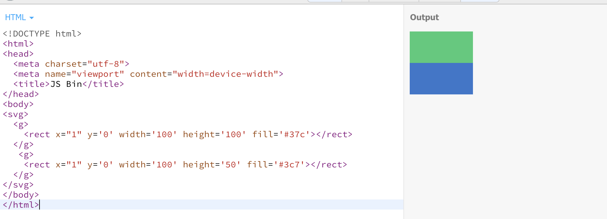

# SVG

SVG 是一种基于 XML 语法的图像处理格式。可以利用 DOM API 操作 SVG 元素。因为它基本上一个元素对应一个图形。Canvas 上较难实现。

属于一种声明式的绘图系统。



```xml
<svg>
  <g>
    <rect x="1" y='0' width='100' height='100' fill='#37c'></rect>
  </g>
   <g>
    <rect x="1" y='0' width='100' height='50' fill='#3c7'></rect>
  </g>
</svg>
```

+ g 表示分组
+ rect 表示绘制一个矩形

# Canvas

Canvas 元素在浏览器上创造了一个空白的画布，我们需要调用渲染上下文，设置各种属性，然后调用绘图指令完成输出。

对 Canvas 来说绘制图形是一系列的过程不做具体图形的区分，较难进行局部控制。

这里一般指 Canvas2D 

```js
const canvas = document.getElementById('my-house');
// 这里的宽高是画布的宽高不是 CSS 样式的宽高
canvas.setAttribute('width','300px');
canvas.setAttribute('height','300px');
// 拿到上下文
const ctx = canvas.getContext('2d');
// x轴 y轴就是画布的坐标系，所绘制的图形以它为左上角
ctx.fillText(text,x,y)
...
```

上面的 300px 就是画布宽高。画布的左上角的坐标系为 (0,0) 右下角的坐标系为 (300,300)。

**注意：这个坐标系的Y轴是向下的**


