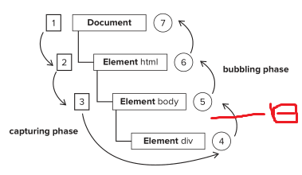

# 移动端兼容处理

## 基础知识

### 元素的高度

+ `clientHeight` : 可理解为内部可视区高度，样式的 `height` +  `padding`
+ `scrollHeight` 网页正文全文高
+ `offsetHeight` 网页可见区域高 ，元素的`height` + `padding` + `border`+ 水平滚动条
+ `scrollTop` 页面被卷上去的高度
+ 

### 键盘弹出

IOS：IOS 的键盘处在窗口的最上层，当键盘弹起时，webview 的高度 height 并没有改变，只是 scrollTop 发生变化，页面可以滚动。且页面可以滚动的最大限度为弹出的键盘的高度，而只有键盘弹出时页面恰好也滚动到最底部时，scrollTop 的变化值为键盘的高度，其他情况下则无法获取。这就导致在 IOS 情况下难以获取键盘的真实高度。

Android: webview 中留出空间，该空间小于等于的键盘空间，变化的高度差会随着布局而不同，有的认为 `键盘高度 + 页面高度 = 原页面高度；` 是错误的误导，只有在某种很巧合的布局情况下才可套用此公式。

### 键盘收起

IOS：触发键盘上的按钮收起键盘或者输入框以外的页面区域时，输入框会失去焦点，因此会触发输入框的 blur 事件。

Android: 触发键盘上的按钮收起键盘时，输入框并不会失去焦点，因此不会触发页面的 blur 事件；触发输入框以外的区域时，输入框会失去焦点，触发输入框的 blur 事件。


### 监听键盘的弹出与收起

```js
const ua = window.navigator.userAgent.toLocaleLowerCase();
const isIOS = /iphone|ipad|ipod/.test(ua);
const isAndroid = /android/.test(ua);


// ios & android 键盘弹出：
const $input = document.getElementById('input');
$input.addEventListener('focus', () => {
	// 处理键盘弹出后所需的页面逻辑
}, false);

// ios 键盘收起：
const $input = document.getElementById('input');
$input.addEventListener('blur', () => {
	// 处理键盘收起后所需的页面逻辑
}, false);

/*键盘弹起后页面高度变小*/
const originHeight = document.documentElement.clientHeight || document.body.clientHeight;
window.addEventListener('resize', () => {
	const resizeHeight = document.documentElement.clientHeight || document.body.clientHeight;
	if (resizeHeight < originHeight) {
		// 键盘弹起所后所需的页面逻辑
	} else {
		// 键盘弹起所后所需的页面逻辑
	}
}, false);


```


## IOS 键盘输入确认搜索后键盘不消失

解决办法：`input` 提交的时候触发  `blur` 事件，让 `input` 失去焦点。

## 移动端底部 input 被弹出的键盘遮挡

最新版的 iOS 没有这个问题，为了兼容老系统。

下面方法二选一就行：

[Element.scrollIntoView()](https://developer.mozilla.org/zh-CN/docs/Web/API/Element/scrollIntoView):方法**让当前的元素滚动到浏览器窗口的可视区域内**。

:[Element.scrollIntoViewIfNeeded()](https://developer.mozilla.org/zh-CN/docs/Web/API/Element/scrollIntoViewIfNeeded) ：方法**用来将不在浏览器窗口的可见区域内的元素滚动到浏览器窗口的可见区域**。

```js
document.querySelector('#inputId').scrollIntoView();
//只要在input的点击事件，或者获取焦点的事件中，加入这个api就好了
```


## [iOS safari浏览器上overflow: scroll元素无法滚动](https://segmentfault.com/a/1190000016408566)

**问题描述：**当 iOS safari 浏览器上出现大于父容器的子元素，想给父容器加上`overflow: scroll`实现内部滚动效果而失败。

**剖析：** safari浏览器在渲染页面元素的时候，会预先走webkit浏览器的渲染流程：

1. 构建DOM tree
2. 构建CSS rule tree
3. 根据DOM和CSS tree来构建render tree
4. 根据render tree计算页面的layout
5. render页面

在第三步和第四步的时候，safari浏览器在构建render tree的时候，会预先找到相应的`overflow: scroll`元素，在计算页面layout的时候，会计算父元素的高度与子元素的高度，若子元素高于父元素，则在**render页面时为其建立一个原生的scrollView。**

这个scrollView有什么用的？其实就是为了给其一个弹弹乐的效果（但确实用户体验不错）。

当子元素是某个媒体格式时，比如img、object（svg）等，safari在加载完成之前是不会在计算在layout之内的，也就是高度为0，**则子元素的高度就一定小于父元素的高度，safari不会给父元素一个原生的scrollView。**

### 解决办法：

方法一：给子元素一个包裹元素，包裹元素设置一个min-height大于父元素的高度，让父元素有scrollView。当子元素加载完成时，将包裹元素撑开，父元素便可以自由滚动了。<small>不一定成功</small>

方法二：通过 `document.addEventListener("scroll", this.onScroll, true);` 监听

```js
// 以上拉刷新举例 
onScroll(e) {
  clearTimeout(this.timer);
  this.timer = setTimeout(() => {
    var clientHeight = document.documentElement.clientHeight; 
    var scrollTop = document.documentElement.scrollTop; 
    var scrollHeight = document.documentElement.scrollHeight; 
	// 
    if (clientHeight + scrollTop + 20 >= scrollHeight) {
      this.bottomCallback();
    }
  }, 200);
},
```

## scroll 事件失效

**问题描述：**在`Vue`中的组件绑定`scroll`事件，事件处理函数似乎不会触发。

### 前置知识 JavaScript事件模型


+ 捕获阶段
  + 事件从`document`到传递到目标元素的过程
+ 冒泡阶段
  + 事件从目标元素传递到`document`的过程

我们一般监听事件的冒泡阶段：`elem.addEventListener('scroll', handler,false)`

`addEventListener`第三个参数可能值:

- true - 事件句柄在捕获阶段执行
- false- false- 默认。事件句柄在冒泡阶段执行

### 失效原因

** `element`的`scroll`事件**不冒泡**, 但是`document`的`defaultView`的`scroll`事件冒泡。**

如果`scroll`的目标元素是一个元素的话，比如说是一个`div`元素。那么此时事件只有从`document`到`div`的捕获阶段以及`div`的冒泡阶段。如果尝试在父级监视`scroll`的冒泡阶段监视这一事件是无效的。如果`scroll`是由`document.defaultView`（目前`document`关联的`window`对象）产生的有冒泡阶段。但是由于其本身就是DOM树里最顶级的对象，因此只能在`window`里监视`scroll`的捕获阶段以及冒泡阶段。



如图所示在目标元素的父级监听是监听不到的。因为只冒泡到了他自己上就断了，不往上冒泡了。

### **解决办法：**

方法一：要确定目标元素是谁，谁产生了`scroll`事件，是谁就在谁上进行监听。

方法二：就是在`window`上监听`scroll`的捕获阶段，即`window.addEventListener('scroll', handler, true)`

## new Date 的兼容性 iOS

**问题描述：使用new Date(time).getTime() 方法转换时间戳。iOS 获取不到。**

### 解决办法

格式一：

2018-03-05 00:00:02 如果 `time` 是这种格式，需要把 “-” 转换成 ` “/” str.replace(/-/g,"/")`

格式二：

2018-03-05 00:00:02.55  这种截取前19位str.substring(0,19) 进行转换。


## 吸顶的写法

### 粘性定位

```css
.sticky {
  position: sticky;
  top: 10px;
}
```

+ 必须指定 top、right、bottom、left 四个阈值的其中之一，粘性定位才会生效。
+ 父容器的高度，应大于粘性定位的元素，粘性布局是对父级滚动元素定位。

### 粘性事件

浏览器暂无提供粘性定位事件，可以用模拟的方式。

监听 scroll 事件，获取目标元素的信息`boundingClientRect`，和设定的值进行比较，然后触发自定义事件。

## 兼容 iPhone X 刘海屏 底部显示

第一步：设置网页在可视窗口的布局方式

```html
<meta name='viewport'  content="width=device-width, viewport-fit=cover"  />
```

第二步：页面主体内容限定在安全区域内

```css
body {
  /* 适配齐刘海*/
  padding-top: constant(safe-area-inset-top);  
 /* 适配底部黑条*/
  padding-bottom: constant(safe-area-inset-bottom);
}

```

fixed 元素的适配

bottom 不是0的情况

```css
/* bottom 不是0的情况 */
.fixed {
  bottom: calc(50px(原来的bottom值) + constant(safe-area-inset-bottom));
}

```

吸底的情况（bottom=0）

```css
/* 方法1 ：设置内边距 扩展高度*/
/* 这个方案需要吸底条必须是有背景色的，因为扩展的部分背景是跟随外容器的，否则出现镂空情况。*/
.fix {
  padding-bottom: constant(safe-area-inset-bottom);
}
/* 直接扩展高度*/
.fix {
  height: calc(60px(原来的高度值) + constant(safe-area-inset-bottom));
}

/* 方法2 ：在元素下面用一个空div填充， 但是背景色要一致 */
.blank {
  position: fixed;
  bottom: 0;
  height: 0;
  width: 100%;
  height: constant(safe-area-inset-bottom);
  background-color: #fff;
}
/* 吸底元素样式 */
.fix {
  margin-bottom: constant(safe-area-inset-bottom);
}

```

第三步：使用 `@supports`

```scss
@supports (bottom: constant(safe-area-inset-bottom)) {
  body {
    padding-bottom: constant(safe-area-inset-bottom);
  }
}
```

完整 `less`

```less
@mixin iphonex-css {
  padding-top: constant(safe-area-inset-top); //为导航栏+状态栏的高度 88px
  padding-top: env(safe-area-inset-top); //为导航栏+状态栏的高度 88px
  padding-left: constant(safe-area-inset-left); //如果未竖屏时为0
  padding-left: env(safe-area-inset-left); //如果未竖屏时为0
  padding-right: constant(safe-area-inset-right); //如果未竖屏时为0
  padding-right: env(safe-area-inset-right); //如果未竖屏时为0
  padding-bottom: constant(safe-area-inset-bottom); //为底下圆弧的高度 34px
  padding-bottom: env(safe-area-inset-bottom); //为底下圆弧的高度 34px
}

/* iphonex 适配 */
@mixin iphonex-media {
  @media only screen and (device-width: 375px) and (device-height: 812px) and (-webkit-device-pixel-ratio: 3) {
    body.iphonex {
      @include iphonex-css;
    }
  }
}

```


