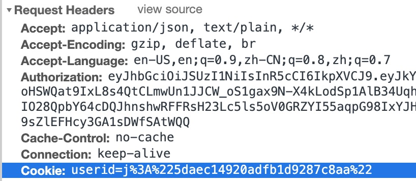

### 1. Cookie 

> Cookie（复数形态Cookies），类型为「小型文本文件」，指某些网站为了辨别用户身份而储存在用户本地终端上的数据。

#### 1.1 Cookie 有什么用？

为了解决 `HTTP` 无状态导致的问题中，客户端与服务端会话状态的问题。这个状态单指后端服务的状态而非通信协议的状态。

1. 会话状态管理（如用户登录状态、购物车、游戏分数或其它需要记录的信息）
2. 个性化设置（如用户自定义设置、主题等）
3. 浏览器行为跟踪（如跟踪分析用户行为等）

#### 1.2 Cookie 有哪些部分组成？

作为一段一般不超过 4KB 的小型文本数据，它由一个名称（Name）、一个值（Value）和其它几个用于控制 Cookie 有效期、安全性、使用范围的可选属性组成。

+ Name / Value

  + 用 JavaScript 操作 Cookie 的时候注意对 Value 进行编码处理。

+ Expirse

  + 用于设置 Cookie 的过期时间。 
  + 当 Expires 属性缺省时，表示是会话性 Cookie。关闭浏览器失效。有些浏览器提供了会话恢复功能，这样会保存 Cookie。
  + 过期的时间只与客户端相关，而不是服务端。

+ Max-Age

  + 用于设置在 Cookie 失效之前需要经过的秒数

    ```js
    res.cookie('userid', user._id, {maxAge: 1000 * 60 * 60 * 24})
    ```

  + Max-Age 可以为正数、负数、甚至是 0。

  + 如果 max-Age 属性为正数时，浏览器会将其持久化，即写到对应的 Cookie 文件中。

  + 当 max-Age 属性为负数，则表示该 Cookie 只是一个会话性 Cookie。

  + 当 max-Age 为 0 时，则会立即删除这个 Cookie。

  + 假如 Expires 和 Max-Age 都存在，Max-Age 优先级更高。

+ Domain

  + 指定了 Cookie 可以送达的主机名

  + 没有指定默认是当前主机部分（不含子域名）

    ```http
    .xxx.com
    ```

+ Path

  + Domain 和 Path 标识共同定义了 Cookie 的作用域：即 Cookie 应该发送给哪些 URL

+ Secure

  + 标记为 Secure 的 Cookie 只应通过被 HTTPS 协议加密过的请求发送给服务端

+ HTTPOnly

  + 设置 HTTPOnly 属性可以防止客户端脚本通过 document.cookie 等方式访问 Cookie，有助于避免 XSS 攻击。

+ #### SameSite

   *Chrome80 版本中默认屏蔽了第三方的 Cookie*

  + SameSite 属性可以让 Cookie 在跨站请求时不会被发送，从而可以阻止跨站请求伪造攻击（CSRF）。
    + **Strict**浏览器将只发送相同站点请求的 Cookie,当前网页 URL 与请求目标 URL 需完全一致。
    + **Lax** 允许部分第三方请求携带 Cookie
    + **None** 无论是否跨站都会发送 Cookie
  + 之前默认是 None 的，Chrome80 后默认是 Lax。

#### 1.3 如何查看 Cookie ? 

+ 可以在浏览器的开发者工具中查看到当前页面的 Cookie
+ 可以在计算机上查看本机的 Cookies 文件 (<small>以 Mac 为例</small>)
  + 路径为:`/Users/haizhi/Library/ApplicationSupport/Google/Chrome/Default`
  + 它是一个 `sqlite` 数据库文件，可以用 `sqlite` 客户端打开查看。

#### 1.4 怎么设置 Cookie

1. 客户端发送 HTTP 请求到服务器

   ```js
   // 登录
   export const reqLogin = data => request('/login', 'POST', data)
   ```

2. 当服务器收到 HTTP 请求时，在响应头里面添加一个 Set-Cookie 字段 (<small> `express` 为例</small>)

   ```js
   router.post('/login', (req, res) => {
     // if success
     res.cookie('userid', user._id, {maxAge: 1000 * 60 * 60 * 24})
   })
   ```

3. 浏览器收到响应后保存下 Cookie

   收到响应：

   

   保存 Cookie:

   

4. 之后对该服务器每一次请求中都通过 Cookie 字段将 Cookie 信息发送给服务器。

   

#### 1.5 Cookie 的缺点

+ 大小方向
+ 安全方向
+ 增加请求方向


### 2. MVC，MVP 和 MVVM

#### 2.1 MVC

*MVC 的意思就是软件可以划分为 3 部分*

+ 视图（View）：用户界面。
+ 控制器（Controller）：业务逻辑
+ 模型（Model）：数据保存

通信流程为：View--Controller--Model--View 循环进行，**所有通信都是单向的**。

1. View 传送指令到 Controller
2. Controller 完成业务逻辑后，要求 Model 改变状态
3. Model 将新的数据发送到 View，用户得到反馈

#### 2.2 MVP

MVP 模式将 Controller 改名为 Presenter（主持人），同时改变了通信方向。


1. 各部分之间的通信，都是双向的。

2. View 与 Model 不发生联系，都通过 Presenter 传递。

3. View 非常薄，不部署任何业务逻辑，称为"被动视图"（Passive View），即没有任何主动性，而 Presenter 非常厚，所有逻辑都部署在那里。

#### 2.3 MVVM

MVVM 模式将 Presenter 改名为 ViewModel，基本上与 MVP 模式完全一致。

唯一的区别是，它采用双向绑定（data-binding）：View的变动，自动反映在 ViewModel，反之亦然。

### 3. 前端路由原理

> 本质是监听 url 的变化，根据匹配的规则动态显示网页。

+ `hash` 模式

  + 通过 `hasChange` 事件监听 `/#/` 后面 `URL` 的变化跳转到对应的页面。
  + `/#/` 后 `URL` 的变化不会向服务端请求数据。
  + 手动刷新当前页面的时候不会触发 `hasChange` 事件。

+  `history` 模式

  + `html5` 新模式，比 `hash` 模式美观（没有 `/#/`）

  + 通过调用 `pushState` `go` 等方法实现跳转。

  + `URl` 改变的时候会向服务端请求，所以部署的时候需要进行重定向。

    ```sh
     # nginx config
     location @router {
                rewrite ^.*$ /index.html break;
        }
    ```

    

### 4. 性能优化 

 URL 输入发生点啥

+ DNS 解析过程
+ HTML词法分析和语法分析，CSS解析
+ 合成图层、合成线程调用光栅化线程池，生成位图后浏览器进程间通信过程，显卡缓存与显示器的关系

### 5. React vs Vue

> vue 和 react 的核心都是专注于轻量级的视图层，虽然只是解决一个很小的问题，但是它们庞大的生态圈提供了丰富的配套工具

#### 5.1 相同点

- 使用 Virtual DOM
- 提供了响应式 (Reactive) 和组件化 (Composable) 的视图组件。
- 将注意力集中保持在核心库，而将其他功能如路由和全局状态管理交给相关的库。

#### 5.2 不同点

##### 5.2 1 设计思想和语法

Vue 渐进式框架，基于可变数据，提供 `v-model` 指定支持双向绑定。React 主张函数式编程，单向数据流。

Vue 有模板，可以直观的编写 `html`。其中`style` 标签提供一个可选的 `scoped` 属性，为组件内的 `css` 提供作用域，控制是对当前组件有效，还是全局组件有效。

React  没有模板，推荐的写法是 `JSX + inline style` ，把所有的`html、css` 都写到`js`里。`jsx`是 `XML` 语法编写 `JavaScript` 的语法糖。

复用层面：React 可通过高阶组件，Hooks 实现，Vue 用 Mixin 实现。

过渡动画：Vue 有提供，React 原生未提供。

全局组件：Vue 声明一次就可以，React 需要一遍遍引入。

Fragments：Vue 没有（造成更多无用元素的嵌套），React 有。

##### 5.2.2 构建工具

构建工具：Vue CLI 可以根据需要删减不需要的功能，便捷，快速。

React 的 ` create-react-app` 在生成项目的时候不允许任何的配置。这也是 React 的优势。

##### 5.2.3 性能优化

Vue 组件自动实现了 ，React 的`shouldComponentUpdate` 生命周期要做的事情。

Vue 因为依赖系统的存在，当任意一个数据发生变动的时候，Vue 的每个组件都会知道自己是否需要进行重新绘制。

